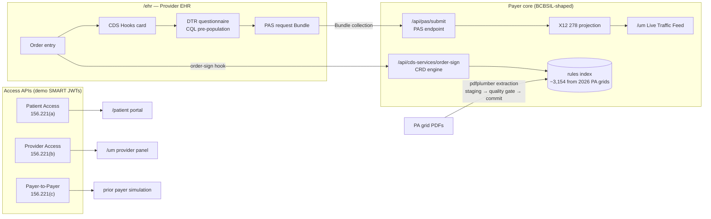
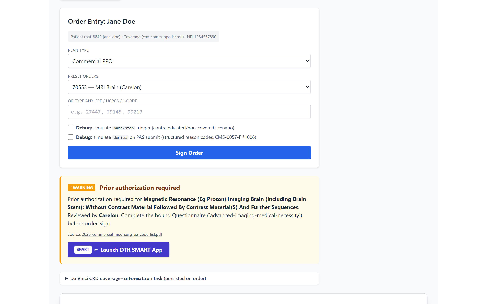
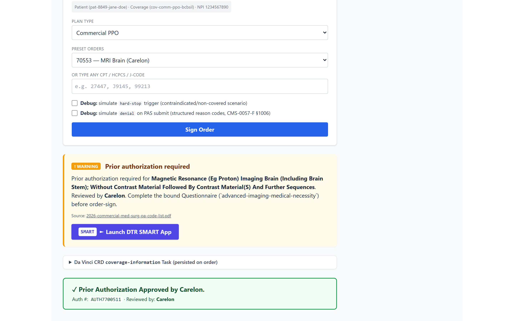
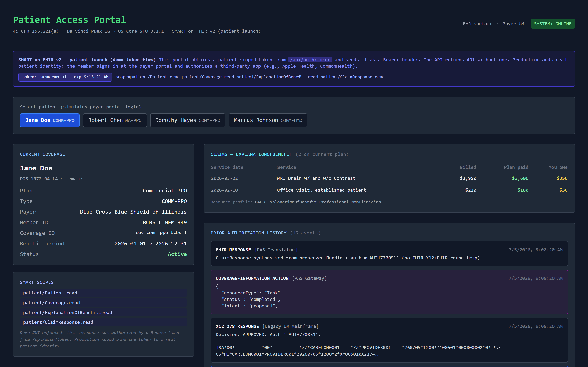
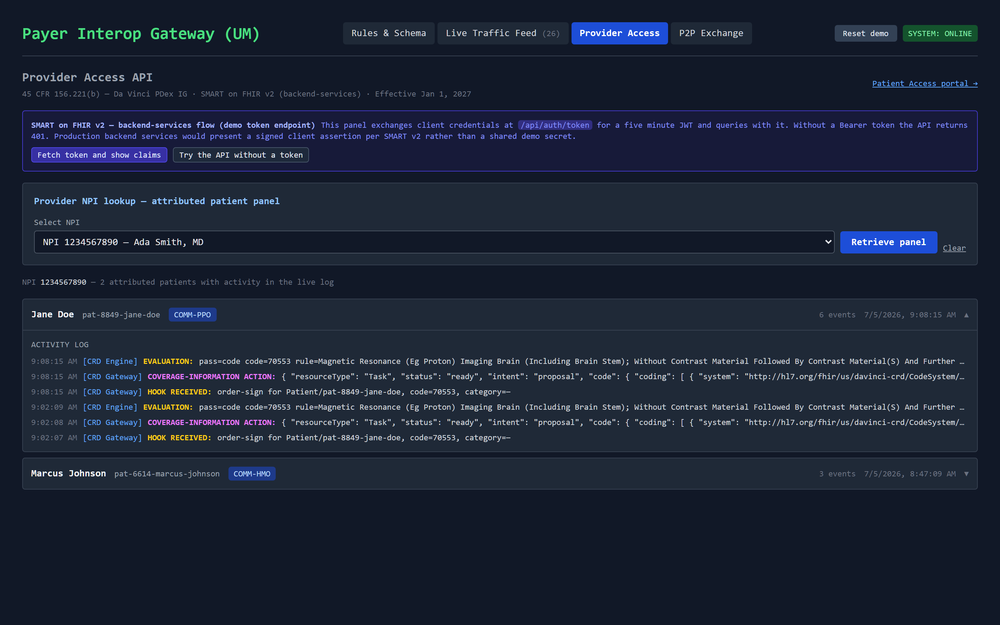
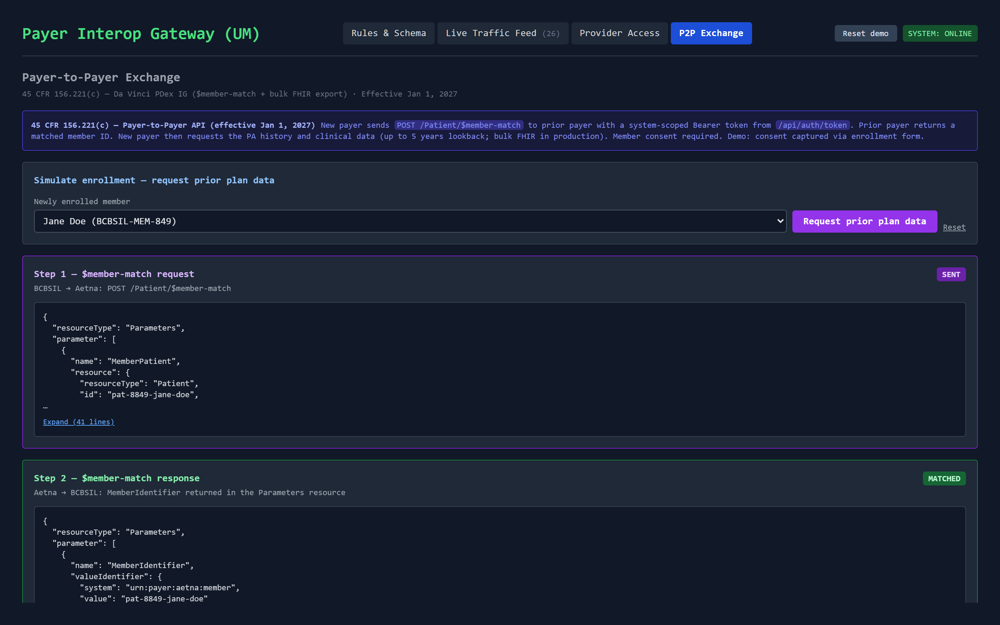
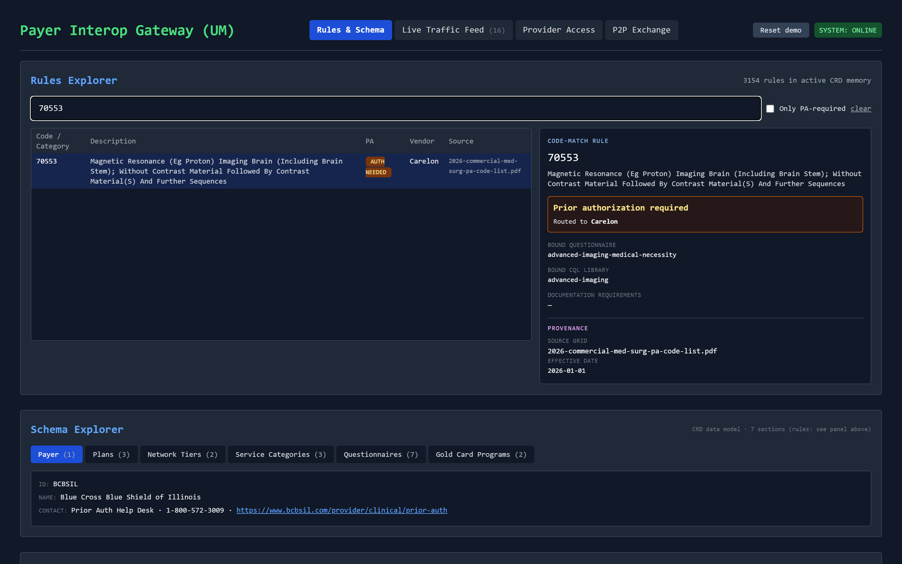

# CMS-0057-F Interoperability Simulator

A working simulation of the payer side of the CMS Interoperability and Prior Authorization final rule (CMS-0057-F). All four mandated FHIR APIs are implemented end to end, driven by approximately 3,154 rules extracted from the publicly available BCBSIL 2026 prior authorization grid PDFs rather than synthetic data.

**Live demo: <https://cms-0057-demo-420776046740.us-central1.run.app/cms-0057>**


Licensed AGPL-3.0-or-later. The source for any deployed instance is this repository.

---

## Why this exists

CMS-0057-F requires impacted payers, which include Medicare Advantage organizations, Medicaid and CHIP programs, and QHP issuers on the federally facilitated exchanges, to expose prior authorization decisions and member data through standard FHIR APIs. The operational provisions, including structured denial reasons and decision timeframes, took effect January 1, 2026, and the API compliance date is January 1, 2027. This project is a working model of what the rule asks payers to build, at demo scale, so the moving parts can be walked through and inspected:

- how a payer turns PDF prior authorization grids into a machine-readable rule index
- how CRD answers "does this order need auth" inside the ordering workflow
- how DTR collects payer-specific documentation with pre-population
- how PAS carries the request and the determination as FHIR while a legacy X12 278 projection runs alongside
- how the same determination then surfaces to the member, to attributed providers, and to a member's next payer

The payer identity, plan structure, and rule data model a BCBSIL-shaped organization. The project is not affiliated with or endorsed by BCBSIL or CMS, and all patients are synthetic.

## The four mandated APIs

| CFR cite | API | Where it lives | Auth |
|---|---|---|---|
| 156.221(d) | Prior Authorization API (CRD → DTR → PAS) | `/ehr` + `/um` Live Traffic Feed | open in demo |
| 156.221(a) | Patient Access API | `/patient` | demo JWT, patient scopes |
| 156.221(b) | Provider Access API | `/um` Provider Access tab | demo JWT, system scopes |
| 156.221(c) | Payer-to-Payer API ($member-match + history) | `/um` P2P Exchange tab | demo JWT, system scopes |

The three access APIs enforce SMART-style Bearer tokens issued by a demo token endpoint (`POST /api/auth/token`, discovery at `/api/.well-known/smart-configuration`). Calling them without a token returns a 401 with an OperationOutcome, which the UI can demonstrate live.

## Touring the live demo

The simulator boots pre-seeded: the full rule index loads on first touch and a replayed demo session populates the live feed, the provider panel, and the patient portal, so every surface has data before the first click. After an idle period the first request may take a few seconds while the container wakes.

1. `/um` → the rule index is already loaded. Search `70553` in the Rules Explorer to see the MRI Brain rule, its Carelon routing, and its provenance back to a source PDF page.
2. `/ehr` → sign the MRI Brain order as Jane Doe. A CDS Hooks card returns with a DTR questionnaire link. Complete it and submit the PAS request.
3. `/um` Live Traffic Feed → expand the FHIR ↔ X12 drawer on the `X12 278 REQUEST` entry to inspect the field-to-segment mapping.
4. `/patient` → the same determination appears in Jane Doe's history through the Patient Access API, alongside CARIN BB shaped claims.
5. `/um` P2P Exchange → run `$member-match` for a newly enrolled member and retrieve the prior plan history as a FHIR Bundle.

The **Reset demo** button in the `/um` header restores the seeded baseline at any time. A separate link resets to an empty index for walking through the PDF ingestion pipeline from a cold start.

## Architecture



Data flow, in short:

- PA grid PDFs → extraction → staging review → committed rule index (or the committed snapshot auto-seeds at boot)
- order-sign hook → gold-card check → code match → category match → category default → plan default
- PAS request Bundle (type `collection`) is preserved unaltered as the source of truth → an X12 278 is generated alongside as a projection for the legacy adjudication engine
- every CRD and PAS event carries NPI and patient metadata → the Patient Access, Provider Access, and P2P surfaces read the same event stream

A production build of this would differ in known ways: a managed FHIR store such as AWS HealthLake or Azure Health Data Services in place of the file-backed sandbox store (HealthLake Advanced also brings native SMART support, at roughly two hundred dollars a month of datastore cost, which is one reason this demo runs on a free tier instead), a durable job queue and worker in place of the request-driven review clock, and asymmetric SMART client registration in place of the shared demo secret. The conformance notes below track what is real and what is simulated.

## Running it

Local:

```powershell
npm install
npm run dev
# open http://localhost:3000/cms-0057
```

The app serves under the `/cms-0057` base path everywhere, so the root URL intentionally 404s. Python with `pdfplumber` is optional and only needed for uploading new PA grid PDFs at runtime. Without it the upload form disables itself and says so, and the pre-ingested snapshot covers the same four grids.

```powershell
python -m pip install pdfplumber   # optional, enables live PDF extraction
```

Docker (includes Python, so the upload pipeline works):

```powershell
docker build -t cms-0057-demo .
docker run -p 3000:3000 cms-0057-demo
```

Deployment: pushes to `main` build the image in GitHub Actions and deploy to Google Cloud Run through keyless Workload Identity Federation (`.github/workflows/deploy-cloudrun.yml`). The service runs with `min-instances 0` and `max-instances 1`, which keeps it inside the Cloud Run always-free tier at demo traffic. The container filesystem and in-memory state reset on scale-to-zero by design, and the first-touch auto-seed rebuilds the demo baseline on every cold start. A manual deploy from a workstation is one command: `gcloud run deploy --source .`.

## Guided walkthroughs

### Prior Authorization API (`/ehr` + `/um`)


**Jane Doe (COMM-PPO)** is the baseline. `99214` returns an info card because the code is not on the PA list. `70553` (MRI Brain) returns a warning indicator, routes to Carelon, and offers the DTR launch. `J9035` (Avastin) with the oncology diagnosis preset returns a critical indicator also routed to Carelon, and the no-oncology-diagnosis variant keeps the same code but re-routes to BCBSIL, which is the conditional routing logic in `lib/routing.js`. Toggling hard-stop produces a non-overridable indicator that disables order-sign.



The DTR pane fetches the bound FHIR Questionnaire, renders `item[]` dynamically, and pre-populates answers marked with an SDC `initialExpression`. Submitting posts a PAS request Bundle (Patient + Coverage + Practitioner + Claim + QuestionnaireResponse, type `collection` with the PAS request-bundle profile). The response is a PAS response Bundle carrying a profiled ClaimResponse plus the Da Vinci CRD coverage-information Task.



For the pended path, switch to **Robert Chen (MA-PPO)** and order `15820` (blepharoplasty). The 2026 grids list that code on the Medicare Advantage list only, which is why the scenario runs under the MA plan. The EHR shows an amber pending state, and the determination finalizes on the first poll after the eight second review window elapses (`lib/pendedReview.js`). The feed shows the full sequence: `BUNDLE RECEIVED` → `PA PENDED` → `PA APPROVED (pended → finalized)` → `REST-HOOK NOTIFICATION`.

For the denial path, check **simulate denial** before submitting any PA-required order. The ClaimResponse returns `outcome: error` with a structured reason code (X12 AAA `A4`) and appeal language, which the operational provisions of the rule require of real denials.

**Dorothy Hayes (COMM-PPO)** has `27447` (TKA) pre-filled and demonstrates the gold-card exemption: Dr. Patel's NPI is enrolled in the Orthopedic Gold Card program, so PA is auto-satisfied. **Marcus Johnson (COMM-HMO)** demonstrates category-level matching, with an ABA order routed to Lucet.

### Patient Access API (`/patient`)



The portal obtains a patient-scoped demo token, displays its decoded claims, and polls the Patient Access API with it. The response carries a US Core shaped Patient, a CARIN BB shaped Coverage, CARIN BB ExplanationOfBenefit resources with the three-part adjudication totals, and the member's PA event history. Selecting a different member re-fetches immediately.

### Provider Access API (`/um` Provider Access tab)



The panel exchanges client credentials for a system-scoped token and retrieves the attributed patient panel for an NPI. The banner includes a **Try the API without a token** button, which surfaces the live 401 and its OperationOutcome, and a control that shows the decoded token claims.

### Payer-to-Payer API (`/um` P2P Exchange tab)



Step 1 sends `POST /Patient/$member-match` with a Parameters body. Step 2 shows the pure Parameters response, and the client reads `MemberIdentifier.valueIdentifier.value` the way a production caller would. Step 3 fetches the prior plan history as a FHIR searchset Bundle: a cancelled prior Coverage, one ClaimResponse per prior authorization (including a denial carried in `error[]` with appeal rights in `processNote`), and CARIN BB EOBs. Jane Doe's prior payer is Aetna and Marcus Johnson's is Cigna, with different histories.

### Rule ingestion pipeline (`/um` Rules & Schema tab)



The demo boots with the snapshot loaded, so the ingestion story starts from the **Reset to an empty index** link: upload one or more PA grid PDFs, watch the extraction land in a staging review with per-source metrics and a quality gate, then commit to the live CRD index. The Rules Explorer resolves any code or category against the committed index and shows routing, bound questionnaire, and provenance down to the source page.

## Conformance notes

Implemented against the specifications:

- CDS Hooks 2.0 discovery at `GET /api/cds-services` and the `order-sign` service at the spec's `{baseUrl}/cds-services/{id}` shape, returning cards plus a `coverage-information` system action per Da Vinci CRD STU 2.2.1 extension URLs
- PAS request and response Bundles of type `collection` claiming the published Da Vinci PAS profiles, with `ClaimResponse.use: preauthorization` and `meta.profile` on the ClaimResponse
- US Core shaped Patient (member number as an MB-typed identifier) and CARIN BB shaped Coverage and ExplanationOfBenefit, with totals sliced by the C4BB adjudication value set (submitted, paid to provider, member liability)
- `$member-match` accepting and returning pure Parameters per the HRex operation, with no convenience fields outside the spec shape
- a FHIR CapabilityStatement at `GET /api/fhir/metadata` declaring the resources, operations, and implementation guides
- SMART-style token issuance and enforcement: `client_credentials` grants, scoped patient/system tokens, 401 with `WWW-Authenticate` on missing tokens, 403 naming missing scopes

Simulated, by design and labeled in the UI:

- authentication uses short-lived HS256 demo JWTs with a shared secret. Production SMART v2 backend services would use registered clients, signed client assertions, and asymmetric keys published through JWKS
- CQL is not executed. DTR pre-population values are hardcoded to match what each library's `define` block would compute for the seed patient
- the X12 278 is illustrative rather than TR3 005010X217 conformant, and receiver IDs are realistic-looking placeholders
- the clinical review on pended requests is a timed simulation finalized on poll. Production would run a durable queue and a worker delivering real rest-hook notifications
- the transaction log, pending map, and committed rules live in process memory and a local JSON file, reset on restart, and re-seed on first touch. Production would use a persistent FHIR store
- prior plan histories in the P2P exchange are seed data in `lib/patients.js`, and behavioral health rules are overridden to `managed_by: "Lucet"` because the BCBSIL BH grid lists BCBSIL as the contact while Lucet is the actual BH utilization management vendor

## What I am building next

CMS proposed a follow-on rule, [CMS-0062-P](https://www.federalregister.gov/documents/2026/04/14/2026-07205/medicare-and-medicaid-programs-patient-protection-and-affordable-care-act-interoperability-standards), on April 10, 2026. Public comment closed June 15, 2026, and the rule is not yet finalized as of this writing. Where CMS-0057-F covered non-drug items and services, 0062-P extends prior authorization interoperability to drugs: medical-benefit drugs through the existing FHIR Prior Authorization API (CRD → DTR → PAS), pharmacy-benefit drugs through NCPDP data-exchange standards. It also proposes to formally adopt FHIR, not X12 EDI, as the HIPAA standard for prior-authorization-related transactions, citing specific implementation guide versions: CARIN Blue Button 2.2.0, Da Vinci PDex 2.1.0, CRD 2.2.1, DTR 2.2.0, and PAS 2.2.1, with older STU 2-era versions proposed to retire by January 1, 2028. A new requirement not present in CMS-0057-F: payers would report their FHIR endpoints, capability statement URLs, and technical documentation to CMS for public posting, reverified annually.

**Already partially supported here**, because the conformance pass in this repo happened to land on the same IG versions 0062-P names:

- the PAS response Bundle and ClaimResponse already claim the Da Vinci PAS profiles at the same v2.2.1 (STU 2) the proposed rule cites
- the CARIN BB ExplanationOfBenefit generator in `lib/eob.js` targets C4BB-ExplanationOfBenefit-Professional-NonClinician v2.2.0, the exact version named
- the CapabilityStatement at `GET /api/fhir/metadata` and the CDS Hooks discovery endpoint are the same shape as the endpoint and capability-statement reporting 0062-P would require payers to expose, though this repo does not yet simulate submitting that information to a central registry

**Not yet supported, and the near-term roadmap:**

- a drug-benefit prior authorization path: medical-benefit drug codes (J-codes already route through the existing rule engine, but nothing marks them drug-specific) and a pharmacy-benefit path modeled on NCPDP rather than FHIR, which is a different transaction set entirely
- drug-specific decision timeframes (the proposed rule cites roughly 24 hours for expedited and 72 hours for standard drug requests, depending on the program), distinct from the illustrative 8 second review window the pended-PA demo uses today
- a simulated FHIR endpoint registry: an endpoint that models submitting this server's own capability statement URL and technical documentation to CMS, and the annual reverification step
- version-pinned profile references (explicit `|2.2.1` style canonical URLs) rather than the unpinned base URLs used today, so the demo can show conformance to a specific IG version rather than just the latest
- Da Vinci CDex for structured attachments alongside a PA request, rather than the plain file upload the DTR pane accepts now
- transaction log persistence across restarts, carried over from before this conformance pass and still open: the log, pending map, and committed rules live in process memory and reset on restart today

A few other candidates I am weighing but have not committed to: bulk FHIR (`$export`) for the Payer-to-Payer history endpoint in place of the current synchronous searchset Bundle, asymmetric SMART client registration (RS256 plus a JWKS endpoint) in place of the shared HS256 demo secret, and a more agentic PDF ingestion pipeline (closer to the hybrid LLM-plus-structural-parsing approach I use professionally) in place of the current pattern-matching extractor. None of these are staged yet, so if one of them matters more than the others for how this repo gets used, that is useful signal for what to build next.

## Where things live

```
app/
  page.jsx                                 Landing page (regulatory framing + tour)
  ehr/page.jsx                             Provider EHR + DTR SMART surface
  patient/page.jsx                         Patient Access Portal
  um/page.jsx                              Payer UM Dashboard (four tabs)
  um/rulesExplorer.jsx                     Rules Explorer panel
  um/schemaExplorer.jsx                    Schema Explorer panel
  um/translatorDrawer.jsx                  FHIR ↔ X12 inline drawer
  um/providerAccess.jsx                    Provider Access tab panel
  um/p2pExchange.jsx                       P2P Exchange tab panel
  um/stagingData.js                        Pattern matchers + staging helpers
  api/
    cds-services/                          CDS Hooks discovery
    cds-services/order-sign/               CRD engine (CDS Hooks 2.0)
    pas/submit/                            PAS endpoint (response Bundles)
    pas/pended/[id]/                       Pended polling + request-driven finalize
    pas/x12Generator.js                    FHIR Bundle → X12 278 + mappings
    fhir/metadata/                         CapabilityStatement
    auth/token/                            Demo SMART token endpoint
    .well-known/smart-configuration/       SMART discovery document
    provider-access/                       Provider Access API (45 CFR 156.221(b))
    patient-access/                        Patient Access API (45 CFR 156.221(a))
    payer-to-payer/member-match/           $member-match (Parameters in and out)
    payer-to-payer/history/[patientId]/    Prior plan history (searchset Bundle)
    demo/reset/                            Seeded / empty demo reset
    extract/                               Live PDF extraction (spawns pdfplumber)
    extract/health/                        Python availability probe
    rules/ · rules/load-pre-ingested/      Active rules + snapshot loader
    schema/ · questionnaire/[id]/ · cql/[id]/
    commit-rules/ · logs/ · logs/clear/
data/
  preIngestedRules.json                    Canonical snapshot (~3,154 rules)
  questionnaires/*.json                    FHIR R4 Questionnaires
  cql/*.cql                                CQL libraries
lib/
  db.js                                    File-backed store, tx log, first-touch seeding
  seed.js                                  Replayed demo session (rules + traffic)
  patients.js                              Single source of truth for demo patients
  fhir.js                                  PAS profiles + response Bundle wrapper
  eob.js                                   CARIN BB EOB generator
  auth.js                                  Demo JWT issue/verify + scope guard
  smartClient.js                           Client-side token cache + authed fetch
  pendedReview.js                          Request-driven pended finalization
  routing.js                               Shared oncology vendor-routing logic
  basePath.js                              /cms-0057 base path helper
  python.js                                Python spawn helper + probe
scripts/
  extractPreIngested.py                    Offline / live PDF → rules extractor
  captureScreenshots.mjs                   Regenerates docs/screenshots (npm run screenshots)
docs/
  screenshots/                             README and portfolio captures
  demo-script.md                           Video storyboard + interview talking points
Dockerfile                                 node + python image (Cloud Run / anywhere)
.github/workflows/deploy-cloudrun.yml      Keyless CI deploy (WIF)
```

## Regenerating the pre-ingested snapshot

The snapshot at `data/preIngestedRules.json` is committed so the demo runs without Python. To re-extract from updated source PDFs, run each extractor against the corresponding file and then merge the four output JSONs.

```powershell
python scripts/extractPreIngested.py ma       <path>/2026-ma-pa-codelist-q2.pdf                          /tmp/ma.json
python scripts/extractPreIngested.py medsurg  <path>/2026-commercial-med-surg-pa-code-list.pdf           /tmp/medsurg.json
python scripts/extractPreIngested.py pharm    <path>/2026-commercial-specialty-pharmacy-pa-code-list.pdf /tmp/pharm.json
python scripts/extractPreIngested.py bh       <path>/2026-commercial-bh-pa-code-list.pdf                 /tmp/bh.json
```

## License

AGPL-3.0-or-later. Anyone running a modified copy as a network service must offer its source to users. This repository is the source for the deployed demo linked above.
