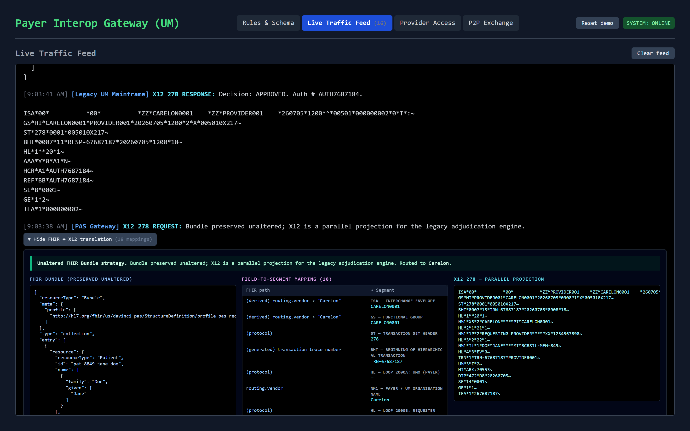

# CMS-0057-F Interoperability Sandbox

A working model of the payer side of the CMS Interoperability and Prior Authorization final rule (CMS-0057-F). All four mandated FHIR APIs are implemented end to end, driven by approximately 3,154 rules extracted from four publicly available 2026 prior authorization grids.

The rule data comes from publicly available BCBSIL documents ([Medicare Advantage](https://www.bcbsil.com/docs/provider/il/claims/um/2026-ma-pa-codelist-q2.pdf), [Commercial Med-Surg](https://www.bcbsil.com/docs/provider/il/claims/um/2026-commercial-med-surg-pa-code-list.pdf), [Specialty Pharmacy](https://www.bcbsil.com/docs/provider/il/claims/um/2026-commercial-specialty-pharmacy-pa-code-list.pdf), [Behavioral Health](https://www.bcbsil.com/docs/provider/il/claims/um/2026-commercial-bh-pa-code-list.pdf)). Not affiliated with or endorsed by BCBSIL or CMS.

**Live demo: <https://surakshith.com/cms-0057>**



Licensed AGPL-3.0-or-later. The source for any deployed instance is this repository.

---

## Why this exists

CMS-0057-F requires impacted payers, which include Medicare Advantage organizations, Medicaid and CHIP programs, and QHP issuers on the federally facilitated exchanges, to expose prior authorization decisions and member data through standard FHIR APIs. The operational provisions, including structured denial reasons and decision timeframes, took effect January 1, 2026, and the API compliance date is January 1, 2027. This project is a working model of what the rule asks payers to build, at demo scale, so the moving parts can be walked through and inspected:

- how a payer turns PDF prior authorization grids into a machine-readable rule index
- how CRD answers "does this order need auth" inside the ordering workflow
- how DTR collects payer-specific documentation with pre-population
- how PAS carries the request and the determination as FHIR while a legacy X12 278 projection runs alongside
- how the same determination then surfaces to the member, to attributed providers, and to a member's next payer

The payer identity, plan structure, and rule data model a BCBSIL-shaped organization. The project is not affiliated with or endorsed by BCBSIL or CMS, and all patients are synthetic.

## The four mandated APIs

| CFR cite | API | Where it lives | Auth |
|---|---|---|---|
| 156.221(d) | Prior Authorization API (CRD → DTR → PAS) | `/ehr` + `/um` Live Traffic Feed | open in demo |
| 156.221(a) | Patient Access API | `/patient` | demo JWT, patient scopes |
| 156.221(b) | Provider Access API | `/um` Provider Access tab | demo JWT, system scopes |
| 156.221(c) | Payer-to-Payer API ($member-match + history) | `/um` P2P Exchange tab | demo JWT, system scopes |

The three access APIs enforce SMART-style Bearer tokens issued by a demo token endpoint (`POST /api/auth/token`, discovery at `/api/.well-known/smart-configuration`). Calling them without a token returns a 401 with an OperationOutcome, which the UI can demonstrate live.

## Touring the live demo

The sandbox boots pre-seeded: the full rule index loads on first touch and a replayed demo session populates the live feed, the provider panel, and the patient portal, so every surface has data before the first click. After an idle period the first request may take a few seconds while the container wakes.

1. `/um` → the rule index is already loaded. Search `70553` in the Rules Explorer to see the MRI Brain rule, its Carelon routing, and its provenance back to a source PDF page.
2. `/ehr` → sign the MRI Brain order as Jane Doe. A CDS Hooks card returns with a DTR questionnaire link. Complete it and submit the PAS request.
3. `/um` Live Traffic Feed → expand the FHIR ↔ X12 drawer on the `X12 278 REQUEST` entry to inspect the field-to-segment mapping.
4. `/patient` → the same determination appears in Jane Doe's history through the Patient Access API, alongside CARIN BB shaped claims.
5. `/um` P2P Exchange → run `$member-match` for a newly enrolled member and retrieve the prior plan history as a FHIR Bundle.

The **Reset demo** button in the `/um` header restores the seeded baseline at any time. A separate link resets to an empty index for walking through the PDF ingestion pipeline from a cold start.

Full per-API walkthroughs with screenshots: [docs/walkthroughs.md](docs/walkthroughs.md).

## Running it

Local:

```powershell
npm install
npm run dev
# open http://localhost:3000/cms-0057
```

The app serves under the `/cms-0057` base path everywhere, so the root URL intentionally 404s. Python with `pdfplumber` is optional and only needed for uploading new PA grid PDFs at runtime. Without it the upload form disables itself and says so, and the pre-ingested snapshot covers the same four grids.

```powershell
python -m pip install pdfplumber   # optional, enables live PDF extraction
```

Docker (includes Python, so the upload pipeline works):

```powershell
docker build -t cms-0057-sandbox .
docker run -p 3000:3000 cms-0057-sandbox
```

Deployment: pushes to `main` build the image in GitHub Actions and deploy to Google Cloud Run through keyless Workload Identity Federation (`.github/workflows/deploy-cloudrun.yml`). The service runs with `min-instances 0` and `max-instances 1`, which keeps it inside the Cloud Run always-free tier at demo traffic. The container filesystem and in-memory state reset on scale-to-zero by design, and the first-touch auto-seed rebuilds the demo baseline on every cold start. A manual deploy from a workstation is one command: `gcloud run deploy --source .`.

## Architecture and conformance

- [docs/architecture.md](docs/architecture.md) — data flow diagram, how a production build would differ, the full repo map
- [docs/conformance.md](docs/conformance.md) — what is implemented against the spec, what is simulated and why, how to regenerate the pre-ingested rule snapshot
- [docs/integrations.md](docs/integrations.md) — connecting the deployed sandbox to public health-IT test tools (CDS Hooks Sandbox, Inferno, SMART App Launcher, Epic, Availity, Optum)

## Connectable to real test tools

The sandbox plugs into public health-IT test tools without special configuration:

- CDS Hooks Sandbox → the CRD engine, via the discovery URL
- SMART App Launcher → `/ehr` as a launched SMART app (public-client PKCE, verified end to end)
- Availity clearinghouse → parallel X12 278 submission alongside the FHIR PAS path (mock mode by default, credentials optional)
- Inferno by ONC → the four FHIR APIs for conformance testing
- Epic on FHIR sandbox → SMART on FHIR launch (working), plus a Backend Services client that reads Epic's own test patients live via an RS384-signed assertion against a published JWKS
- Optum real payer API → a second, independent payer's own CRD → DTR → PAS chain plus Provider Access $bulk-member-match, live and verified against a real UnitedHealthcare-shaped implementation

Setup and current status for each is in [docs/integrations.md](docs/integrations.md).

## Asymmetric SMART auth

This sandbox's own token endpoint signs with RS384 and publishes its public key at `/api/.well-known/jwks.json` when a keypair is configured (`SANDBOX_PRIVATE_KEY_B64`), falling back to a demo HS256 secret when it is not — either way the 401 → token → 200 mechanics are the same. The same keypair signs the client assertion this sandbox sends as an outbound SMART Backend Services client to Epic's FHIR sandbox. See [docs/conformance.md](docs/conformance.md) for what that unlocks and [docs/integrations.md](docs/integrations.md) for the Epic outcome.

## How this was built

[docs/case-study.md](docs/case-study.md) covers the timeline, the decisions and the constraints that forced them, the defects that mattered, and where AI sat in the build loop.

## What I am building next

CMS proposed a follow-on rule, [CMS-0062-P](https://www.federalregister.gov/documents/2026/04/14/2026-07205/medicare-and-medicaid-programs-patient-protection-and-affordable-care-act-interoperability-standards), on April 10, 2026. Comment period closed June 15, 2026; not yet finalized. It extends CMS-0057-F's prior authorization mandate to drugs and proposes FHIR, not X12, as the formal HIPAA standard for these transactions.

**Already lines up with it,** because the conformance pass in this repo happened to land on the same IG versions the proposed rule names:

- **PAS profiles** — the response Bundle and ClaimResponse already claim Da Vinci PAS v2.2.1, the exact version cited
- **CARIN BB EOBs** — `lib/eob.js` targets C4BB v2.2.0, also the exact version cited
- **Endpoint reporting shape** — the CapabilityStatement and CDS discovery endpoints are the same shape as the endpoint-reporting requirement the proposed rule would add, though nothing here submits that information to a registry yet

**On the roadmap:**

- **Drug-benefit PA path** — medical-benefit drugs via the existing FHIR API, pharmacy-benefit drugs via NCPDP, a separate transaction set this sandbox does not touch today
- **Drug-specific decision timeframes** — roughly 24 hours expedited / 72 hours standard per the proposed rule, distinct from the illustrative 8-second review window used today
- **Simulated FHIR endpoint registry** — an endpoint modeling the capability-statement reporting to CMS the proposed rule would require
- **Version-pinned profile references** — explicit `|2.2.1`-style canonical URLs in place of the unpinned ones used today
- **Da Vinci CDex attachments** — structured attachment exchange in place of the plain file upload the DTR pane accepts now
- **Transaction log persistence** — carried over from before this conformance pass; the log, pending map, and committed rules reset on restart today
- **Bulk FHIR `$export`** — for the Payer-to-Payer history endpoint, in place of the synchronous searchset Bundle
- **More agentic PDF ingestion** — an LLM classification pass over the text the parser already pulls, with the current pattern-matching extractor as a confidence-gated fallback

## License

AGPL-3.0-or-later. Anyone running a modified copy as a network service must offer its source to users. This repository is the source for the deployed demo linked above.
