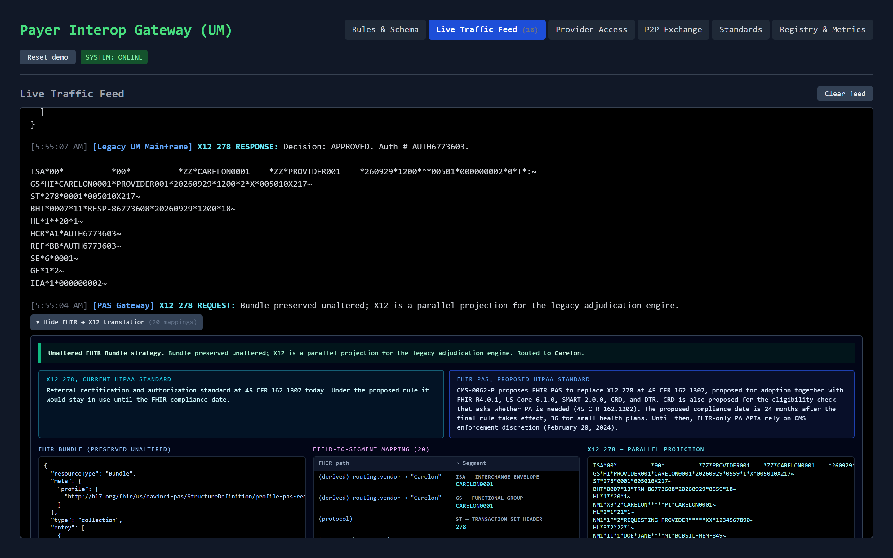

# CMS-0057-F interoperability sandbox

A working model of the payer side of the CMS Interoperability and Prior Authorization final rule (CMS-0057-F). All four mandated FHIR APIs are implemented end to end, driven by approximately 3,154 rules extracted from four publicly available 2026 prior authorization grids. It also models the proposed follow-on rule, CMS-0062-P, which extends prior authorization to drugs.

The rule data comes from publicly available BCBSIL documents ([Medicare Advantage](https://www.bcbsil.com/docs/provider/il/claims/um/2026-ma-pa-codelist-q2.pdf), [Commercial Med-Surg](https://www.bcbsil.com/docs/provider/il/claims/um/2026-commercial-med-surg-pa-code-list.pdf), [Specialty Pharmacy](https://www.bcbsil.com/docs/provider/il/claims/um/2026-commercial-specialty-pharmacy-pa-code-list.pdf), [Behavioral Health](https://www.bcbsil.com/docs/provider/il/claims/um/2026-commercial-bh-pa-code-list.pdf)). Not affiliated with or endorsed by BCBSIL or CMS.

Live demo: <https://surakshith.com/cms-0057>



Licensed AGPL-3.0-or-later. The source for any deployed instance is this repository.

---

## Why this exists

CMS-0057-F requires impacted payers, including Medicare Advantage organizations, Medicaid and CHIP programs, and QHP issuers on the federally facilitated exchanges, to expose prior authorization decisions and member data through standard FHIR APIs. The operational provisions, including structured denial reasons and decision timeframes, took effect January 1, 2026, and the API compliance date is January 1, 2027. This project models what the rule asks payers to build at demo scale so the parts can be inspected:

- how a payer turns PDF prior authorization grids into a machine-readable rule index
- how CRD answers "does this order need auth" inside the ordering workflow
- how DTR collects payer-specific documentation with pre-population
- how PAS carries the request and the determination as FHIR while a legacy X12 278 projection runs alongside
- how the same determination then surfaces to the member, to attributed providers, and to a member's next payer

The payer identity, plan structure, and rule data model a BCBSIL-shaped organization. The project is not affiliated with or endorsed by BCBSIL or CMS, and all patients are synthetic.

## The four mandated APIs

| CFR cite | API | Where it lives | Auth |
|---|---|---|---|
| 156.223 | Prior Authorization API (CRD → DTR → PAS) | `/ehr` + `/um` Live Traffic Feed | open in demo |
| 156.221(a) | Patient Access API | `/patient` | demo JWT, patient scopes |
| 156.222(a) | Provider Access API | `/um` Provider Access tab | demo JWT, system scopes |
| 156.222(b) | Payer-to-Payer API ($member-match + history) | `/um` P2P Exchange tab | demo JWT, system scopes |

The 45 CFR sections above are for QHP issuers. The parallel sections are 42 CFR 422.119, 422.121, 422.122 for MA, 42 CFR 431.60, 431.61, 431.80 for Medicaid, and 42 CFR 457.730, 457.731, 457.732 for CHIP.

The three access APIs enforce SMART-style Bearer tokens issued by a demo token endpoint (`POST /api/auth/token`, discovery at `/api/.well-known/smart-configuration`). Calling them without a token returns a 401 with an OperationOutcome, which the UI can demonstrate live.

## CMS-0062-P, the proposed follow-on rule

[CMS-0062-P](https://www.federalregister.gov/documents/2026/04/14/2026-07205/medicare-and-medicaid-programs-patient-protection-and-affordable-care-act-interoperability-standards) was published April 14, 2026. It is not final, so everything here follows the proposed text. What the sandbox models:

- One drug, two benefits: Certolizumab on the real BCBSIL grid (J0717, "not for use when drug is self administered"). Clinic-administered → CRD → DTR → PAS. Self-administered → RTPB → F&B → NCPDP ePA. Both tracks share one question set, one decision, and one coded reason, so a drug that changes benefit is not re-asked
- Decision clocks: by program, with the citation on every decision. Medicaid has 24 hours plus a 72-hour emergency supply. The demo also covers the proposed QHP drug clocks, MA Part B and Part D, and no federal clock for commercial employer plans
- Drug PAs in the access APIs: Patient Access, Provider Access, and Payer-to-Payer use PDex-shaped ExplanationOfBenefit resources. A `/pharmacy` lookup gives a dispensing pharmacy the same decision
- Versioned standards: One IG registry drives the CapabilityStatement and a Standards tab with sunset markers. Patient Access moved to US Core 6.1.0 because 3.1.1 expired on January 1, 2026
- Reporting: An endpoint report of base FHIR `Endpoint` resources, API usage with third-party error rates, and PA metrics as counts plus percentages
- CDex attachments: pended requests can carry attachments, and a clearinghouse hop rejects a nonconforming PAS Bundle before it reaches the payer

The plan, the positions behind it, and the rule text each one ties to: [docs/cms-0062-p-implementation-plan.md](docs/cms-0062-p-implementation-plan.md).

## Touring the live demo

The sandbox boots pre-seeded: the full rule index loads on first touch and a replayed demo session populates the live feed, the provider panel, and the patient portal, so every surface has data before the first click. After an idle period the first request may take a few seconds while the container wakes.

1. `/um` → the rule index is already loaded. Search `70553` in the Rules Explorer to see the MRI Brain rule, its Carelon routing, and its provenance back to a source PDF page.
2. `/ehr` → sign the MRI Brain order as Jane Doe. A CDS Hooks card returns with a DTR questionnaire link. Complete it and submit the PAS request.
3. `/um` Live Traffic Feed → expand the FHIR ↔ X12 drawer on the `X12 278 REQUEST` entry to inspect the field-to-segment mapping.
4. `/patient` → the same determination appears in Jane Doe's history through the Patient Access API, alongside CARIN BB shaped claims.
5. `/um` P2P Exchange → run `$member-match` for a newly enrolled member and retrieve the prior plan history as a FHIR Bundle.

For the CMS-0062-P additions:

1. `/ehr` → pick a certolizumab order, clinic-administered or self-administered, and leave the step therapy box unchecked. Then run the other one and watch the answers carry over and both tracks deny with the same reason.
2. `/ehr` → select Maria Santos (Medicaid) or David Kim (QHP) and sign the default order to see the decision clock for that program.
3. `/pharmacy` → look up Jane Doe and the certolizumab NDC.
4. `/um` Standards and Registry & Metrics tabs.

The Reset demo button in the `/um` header restores the seeded baseline at any time. A separate link resets to an empty index for walking through the PDF ingestion pipeline from a cold start.

Full per-API walkthroughs with screenshots: [docs/walkthroughs.md](docs/walkthroughs.md).

## Running it

Local:

```powershell
npm install
npm run dev
# open http://localhost:3000/cms-0057
```

The app serves under the `/cms-0057` base path everywhere, so the root URL intentionally 404s. Python with `pdfplumber` is optional and only needed for uploading new PA grid PDFs at runtime. Without it the upload form disables itself and says so, and the pre-ingested snapshot covers the same four grids.

```powershell
python -m pip install pdfplumber   # optional, enables live PDF extraction
```

Checks, against a running production build (`npm run build` then `npm start`):

```powershell
npm run regression        # API behavior, one section per phase
npm run ui-smoke          # every surface in a real browser (needs npx playwright install chromium)
node scripts/testElm.mjs  # the hand-authored MRI Brain ELM, no server needed
```

Docker (includes Python, so the upload pipeline works):

```powershell
docker build -t cms-0057-sandbox .
docker run -p 3000:3000 cms-0057-sandbox
```

Deployment: pushes to `main` build the image in GitHub Actions and deploy to Google Cloud Run through keyless Workload Identity Federation (`.github/workflows/deploy-cloudrun.yml`). The service runs with `min-instances 0` and `max-instances 1`, which keeps it inside the Cloud Run always-free tier at demo traffic. The container filesystem and in-memory state reset on scale-to-zero by design, and the first-touch auto-seed rebuilds the demo baseline on every cold start. A manual deploy from a workstation is one command: `gcloud run deploy --source .`.

## Architecture and conformance

- [docs/architecture.md](docs/architecture.md): data flow diagram, how a production build would differ, and the full repo map
- [docs/conformance.md](docs/conformance.md): what is implemented against the spec, what is simulated and why, and how to regenerate the pre-ingested rule snapshot
- [docs/integrations.md](docs/integrations.md): connecting the deployed sandbox to public health-IT test tools (CDS Hooks Sandbox, Inferno, SMART App Launcher, Epic, Availity, Optum)

## Connectable to real test tools

The sandbox plugs into public health-IT test tools without special configuration:

- CDS Hooks Sandbox: the CRD engine, via the discovery URL
- SMART App Launcher: `/ehr` as a launched SMART app (public-client PKCE, verified end to end)
- Availity clearinghouse: a live X12 270/271 eligibility check fires at order-sign time against the real Availity Coverages API
- Inferno by ONC: the four FHIR APIs for conformance testing
- Epic on FHIR sandbox: SMART on FHIR launch (working), plus a Backend Services client that reads Epic's own test patients live via an RS384-signed assertion against a published JWKS. Its DTR pre-population path runs a real CQL/ELM library against a Bundle assembled from Epic, in-process via `cql-execution` because Epic's sandbox has no CQL endpoint. Patient reads succeed live. Condition and Observation reads currently return 403 under the existing app registration, so the pipeline evaluates over Patient only until a fresh Epic app is registered with the wider scope set. Partial failure adds those to a `warnings[]` array without failing the whole pre-population.
- Optum real payer API: a second, independent payer's own CRD → DTR → PAS chain plus Provider Access $bulk-member-match. The prior-auth chain is live and verified. Two Provider Access operations added in this pass return errors against the live sandbox (400 on `$bulk-member-match` with the spec-shape PDex bundle, 405 on `$davinci-data-export`) that the Optum OAS does not explain, in the same class as the CDS Hooks path-mismatch already recorded. Mock mode covers both end to end, so the demo walks the full three-step export UI without credentials. See `docs/integrations.md` for the exact error bodies.

Setup and current status for each is in [docs/integrations.md](docs/integrations.md).

## Asymmetric SMART auth

This sandbox's own token endpoint signs with RS384 and publishes its public key at `/api/.well-known/jwks.json` when a keypair is configured (`SANDBOX_PRIVATE_KEY_B64`). Otherwise it falls back to a demo HS256 secret. Either way the 401 → token → 200 mechanics are the same. The same keypair signs the client assertion this sandbox sends as an outbound SMART Backend Services client to Epic's FHIR sandbox. See [docs/conformance.md](docs/conformance.md) for what that enables and [docs/integrations.md](docs/integrations.md) for the Epic outcome.

## How this was built

[docs/case-study.md](docs/case-study.md) covers the timeline, the decisions and the constraints that forced them, the defects that mattered, and where AI sat in the build loop.

## What I am building next

The CMS-0062-P comment period closed June 15, 2026, and the rule is not final yet. If the final rule changes versions, dates, or clocks, the registry in `lib/fhir.js` and the clocks in `lib/decisionClock.js` are the places to update.

The CMS-0062-P items that were on this list (drug PA on both benefits, drug decision clocks, the endpoint report, version-pinned profiles, and CDex attachments) are now built. See the section above.

Still on the roadmap:

- Transaction log persistence: The log, pending map, drug PA records, and metrics reset on restart today
- Bulk FHIR `$export`: for the Payer-to-Payer history endpoint, in place of the synchronous searchset Bundle
- More agentic PDF ingestion: an LLM classification pass over the text the parser already pulls, with the current pattern-matching extractor as a confidence-gated fallback
- An appeal flow, so the appeal and overturn metrics carry real counts
- NCPDP cancel and appeal messages on the pharmacy track, which the first cut left out
- Pharmacy-benefit PAs in the PDex profile, if a future PDex version admits NDC codes. The current profile does not, which is recorded as a finding in [docs/conformance.md](docs/conformance.md)

## License

AGPL-3.0-or-later. Anyone running a modified copy as a network service must offer its source to users. This repository is the source for the deployed demo linked above.
