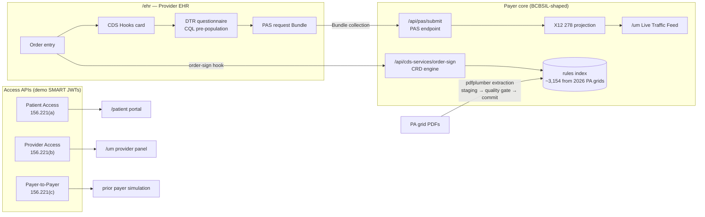

# Architecture



## Data flow, in short

- PA grid PDFs → extraction → staging review → committed rule index (or the committed snapshot auto-seeds at boot)
- order-sign hook → gold-card check → code match → category match → category default → plan default
- PAS request Bundle (type `collection`) is preserved unaltered as the source of truth → an X12 278 is generated alongside as a projection for the legacy adjudication engine
- every CRD and PAS event carries NPI and patient metadata → the Patient Access, Provider Access, and P2P surfaces read the same event stream

## Where a production build would differ

A managed FHIR store such as AWS HealthLake or Azure Health Data Services in place of the file-backed sandbox store (HealthLake Advanced also brings native SMART support, at roughly two hundred dollars a month of datastore cost, which is one reason this demo runs on a free tier instead), a durable job queue and worker in place of the request-driven review clock, and asymmetric SMART client registration in place of the shared demo secret. [Conformance notes](conformance.md) track what is real and what is simulated in more detail.

## Where things live

```
app/
  page.jsx                                 Landing page (regulatory framing + tour)
  ehr/page.jsx                             Provider EHR + DTR SMART surface
  patient/page.jsx                         Patient Access Portal
  um/page.jsx                              Payer UM Dashboard (four tabs)
  um/rulesExplorer.jsx                     Rules Explorer panel
  um/schemaExplorer.jsx                    Schema Explorer panel
  um/translatorDrawer.jsx                  FHIR ↔ X12 inline drawer
  um/providerAccess.jsx                    Provider Access tab panel
  um/p2pExchange.jsx                       P2P Exchange tab panel
  um/stagingData.js                        Pattern matchers + staging helpers
  api/
    cds-services/                          CDS Hooks discovery
    cds-services/order-sign/               CRD engine (CDS Hooks 2.0)
    pas/submit/                            PAS endpoint (response Bundles)
    pas/pended/[id]/                       Pended polling + request-driven finalize
    pas/x12Generator.js                    FHIR Bundle → X12 278 + mappings
    fhir/metadata/                         CapabilityStatement
    auth/token/                            Demo SMART token endpoint
    .well-known/smart-configuration/       SMART discovery document
    provider-access/                       Provider Access API (45 CFR 156.221(b))
    patient-access/                        Patient Access API (45 CFR 156.221(a))
    payer-to-payer/member-match/           $member-match (Parameters in and out)
    payer-to-payer/history/[patientId]/    Prior plan history (searchset Bundle)
    demo/reset/                            Seeded / empty demo reset
    extract/                               Live PDF extraction (spawns pdfplumber)
    extract/health/                        Python availability probe
    rules/ · rules/load-pre-ingested/      Active rules + snapshot loader
    schema/ · questionnaire/[id]/ · cql/[id]/
    commit-rules/ · logs/ · logs/clear/
data/
  preIngestedRules.json                    Canonical snapshot (~3,154 rules)
  questionnaires/*.json                    FHIR R4 Questionnaires
  cql/*.cql                                CQL libraries
lib/
  db.js                                    File-backed store, tx log, first-touch seeding
  seed.js                                  Replayed demo session (rules + traffic)
  patients.js                              Single source of truth for demo patients
  fhir.js                                  PAS profiles + response Bundle wrapper
  eob.js                                   CARIN BB EOB generator
  auth.js                                  Demo JWT issue/verify + scope guard
  smartClient.js                           Client-side token cache + authed fetch
  pendedReview.js                          Request-driven pended finalization
  routing.js                               Shared oncology vendor-routing logic
  basePath.js                              /cms-0057 base path helper
  python.js                                Python spawn helper + probe
scripts/
  extractPreIngested.py                    Offline / live PDF → rules extractor
  captureScreenshots.mjs                   Regenerates docs/screenshots (npm run screenshots)
docs/
  architecture.md                          This file
  walkthroughs.md                          Per-API guided walkthroughs
  conformance.md                           Implemented vs. simulated, snapshot regen
  screenshots/                             README and portfolio captures
  demo-script.md                           Video storyboard + interview talking points
Dockerfile                                 node + python image (Cloud Run / anywhere)
.github/workflows/deploy-cloudrun.yml      Keyless CI deploy (WIF)
```
