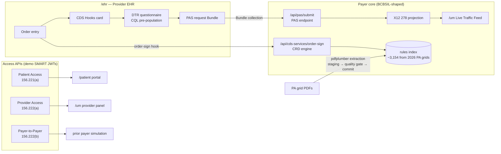
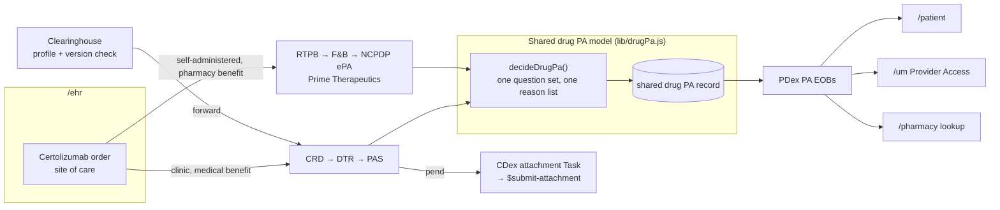

# Architecture


```mermaid
flowchart LR
  subgraph Provider["/ehr — Provider EHR"]
    ORD[Order entry] --> CARD[CDS Hooks card]
    CARD --> DTR[DTR questionnaire<br/>CQL pre-population]
    DTR --> PASB[PAS request Bundle]
  end

  subgraph Payer["Payer core (BCBSIL-shaped)"]
    CRD["/api/cds-services/order-sign<br/>CRD engine"]
    RULES[("rules index<br/>~3,154 from 2026 PA grids")]
    PAS["/api/pas/submit<br/>PAS endpoint"]
    X12[X12 278 projection]
    FEED["/um Live Traffic Feed"]
    CRD --> RULES
    PAS --> X12 --> FEED
  end

  subgraph Access["Access APIs (demo SMART JWTs)"]
    PT["Patient Access<br/>156.221(a)"]
    PR["Provider Access<br/>156.222(a)"]
    P2P["Payer-to-Payer<br/>156.222(b)"]
  end

  ORD -->|order-sign hook| CRD
  PASB -->|Bundle collection| PAS
  PT --> PORTAL["/patient portal"]
  PR --> PANEL["/um provider panel"]
  P2P --> PRIOR["prior payer simulation"]
  INGEST[PA grid PDFs] -->|pdfplumber extraction<br/>staging → quality gate → commit| RULES
```

### CMS-0062-P additions (proposed rule)


```mermaid
flowchart LR
  subgraph EHR["/ehr"]
    DRUG["Certolizumab order<br/>site of care"]
  end

  subgraph Shared["Shared drug PA model (lib/drugPa.js)"]
    DEC["decideDrugPa()<br/>one question set, one reason list"]
    REC[("shared drug PA record")]
  end

  DRUG -->|clinic, medical benefit| CRD2["CRD → DTR → PAS"]
  DRUG -->|self-administered, pharmacy benefit| NCPDP["RTPB → F&B → NCPDP ePA<br/>Prime Therapeutics"]
  CRD2 --> DEC
  NCPDP --> DEC
  DEC --> REC
  REC --> EOB["PDex PA EOBs"]
  EOB --> PAT["/patient"]
  EOB --> PROV["/um Provider Access"]
  EOB --> RX["/pharmacy lookup"]
  CRD2 -->|pend| CDEX["CDex attachment Task<br/>→ $submit-attachment"]
  CH["Clearinghouse<br/>profile + version check"] -->|forward| CRD2
```

- Every decision carries a legal clock (`lib/decisionClock.js`) and a `pa` metrics tag
- `withUsage()` meters each API route → the Registry & Metrics tab
- `IG_REGISTRY` in `lib/fhir.js` drives the CapabilityStatement, the Standards tab, and the clearinghouse version check

## Data flow, in short

- PA grid PDFs → extraction → staging review → committed rule index (or the committed snapshot auto-seeds at boot)
- order-sign hook → gold-card check → code match → category match → category default → plan default
- PAS request Bundle (type `collection`) is preserved unaltered as the source of truth → an X12 278 is generated alongside as a projection for the legacy adjudication engine
- every CRD and PAS event carries NPI and patient metadata → the Patient Access, Provider Access, and P2P surfaces read the same event stream

## Where a production build would differ

A production build would use a managed FHIR store such as AWS HealthLake or Azure Health Data Services instead of the file-backed sandbox store. HealthLake Advanced also brings native SMART support at roughly two hundred dollars a month of datastore cost, one reason this demo runs on a free tier. It would also use a durable job queue and worker instead of the request-driven review clock, and asymmetric SMART client registration instead of the shared demo secret. [Conformance notes](conformance.md) track what is real and what is simulated in more detail.

## Where things live

```
app/
  page.jsx                                 Landing page (regulatory framing + tour)
  ehr/page.jsx                             Provider EHR + DTR SMART surface
  patient/page.jsx                         Patient Access Portal
  pharmacy/page.jsx                        Pharmacy PA lookup (CMS-0062-P)
  ehr/pharmacyEpa.jsx                      Pharmacy-benefit drug track panel
  components/ClockBadge.jsx                Decision clock badge (/ehr, /um)
  components/DrugPriorAuths.jsx            Drug PA EOB list (/patient, /um, /pharmacy)
  um/page.jsx                              Payer UM Dashboard (six tabs)
  um/standardsPanel.jsx                    Standards tab (IG versions, sunset markers)
  um/registryMetrics.jsx                   Registry & Metrics tab
  um/rulesExplorer.jsx                     Rules Explorer panel
  um/schemaExplorer.jsx                    Schema Explorer panel
  um/translatorDrawer.jsx                  FHIR ↔ X12 drawer, HIPAA transition view, NCPDP viewer
  um/providerAccess.jsx                    Provider Access tab panel
  um/p2pExchange.jsx                       P2P Exchange tab panel
  um/stagingData.js                        Pattern matchers + staging helpers
  api/
    cds-services/                          CDS Hooks discovery
    cds-services/order-sign/               CRD engine (CDS Hooks 2.0)
    pas/submit/                            PAS endpoint (response Bundles)
    pas/pended/[id]/                       Pended polling + request-driven finalize
    pas/x12Generator.js                    FHIR Bundle → X12 278 + mappings, 278 responses (HCR / AAA)
    drug-pa/pharmacy/                      Pharmacy-benefit drug track (RTPB, F&B, NCPDP ePA)
    drug-pa/record/                        Shared drug PA record
    pharmacy/pa-status/                    Pharmacy PA lookup (system scopes)
    cdex/$submit-attachment/               CDex attachment submission
    clearinghouse/pas/                     Clearinghouse conformance hop in front of PAS
    registry/endpoints/                    Endpoint report (base FHIR Endpoint resources)
    metrics/                               API usage and PA metrics
    fhir/metadata/                         CapabilityStatement
    auth/token/                            Demo SMART token endpoint
    .well-known/smart-configuration/       SMART discovery document
    provider-access/                       Provider Access API (45 CFR 156.222(a))
    patient-access/                        Patient Access API (45 CFR 156.221(a))
    payer-to-payer/member-match/           $member-match (Parameters in and out)
    payer-to-payer/history/[patientId]/    Prior plan history (searchset Bundle)
    demo/reset/                            Seeded / empty demo reset
    extract/                               Live PDF extraction (spawns pdfplumber)
    extract/health/                        Python availability probe
    rules/ · rules/load-pre-ingested/      Active rules + snapshot loader
    schema/ · questionnaire/[id]/ · cql/[id]/
    commit-rules/ · logs/ · logs/clear/
data/
  preIngestedRules.json                    Canonical snapshot (~3,154 rules)
  questionnaires/*.json                    FHIR R4 Questionnaires
  cql/*.cql                                CQL libraries
lib/
  db.js                                    File-backed store, tx log, first-touch seeding
  seed.js                                  Replayed demo session (rules + traffic)
  patients.js                              Single source of truth for demo patients
  fhir.js                                  PAS profiles, review action helpers, IG_REGISTRY, dates
  drugPa.js                                Shared drug PA model (catalog, questions, decision, reasons)
  drugPaAccess.js                          Drug PA records → PDex PA EOBs for the access APIs
  ncpdpGenerator.js                        Illustrative NCPDP RTPB / ePA messages
  decisionClock.js                         Legal decision clocks by plan, drug or item, benefit
  cdex.js                                  CDex attachment Task, $submit-attachment builder and validator
  clearinghouse.js                         PAS profile and version conformance check
  paMetrics.js                             PA and API usage metrics
  withUsage.js                             Route wrapper that records API usage
  integrationLabel.js                      "Sandbox response" / "saved copy" panel labels
  origin.js                                Public origin behind the Cloud Run proxy
  bodyLimit.js                             Request body size guard for POST routes outside withUsage
  rateLimit.js                             Per-integration cap on the live Optum, Availity, and Epic routes
  eob.js                                   CARIN BB EOB and PDex PA EOB generators
  auth.js                                  Demo JWT issue/verify + scope guard
  smartClient.js                           Client-side token cache + authed fetch
  pendedReview.js                          Request-driven pended finalization
  routing.js                               Shared oncology vendor-routing logic
  basePath.js                              /cms-0057 base path helper
  python.js                                Python spawn helper + probe
scripts/
  extractPreIngested.py                    Offline / live PDF → rules extractor
  captureScreenshots.mjs                   Regenerates docs/screenshots (npm run screenshots)
  regression.mjs                           API regression checks by phase (npm run regression)
  uiSmoke.mjs                              Playwright load and click-through of every surface (npm run ui-smoke)
  testElm.mjs                              Pass/fail check of the hand-authored MRI Brain ELM
docs/
  architecture.md                          This file
  walkthroughs.md                          Per-API guided walkthroughs
  conformance.md                           Implemented vs. simulated, snapshot regen
  screenshots/                             README and portfolio captures
  demo-script.md                           Video storyboard + interview talking points
  cms-0062-p-implementation-plan.md        CMS-0062-P plan, positions, and rule anchors
Dockerfile                                 node + python image (Cloud Run / anywhere)
.github/workflows/deploy-cloudrun.yml      Keyless CI deploy (WIF)
```
