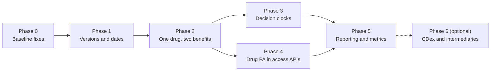

# CMS-0062-P Implementation Plan

I plan to extend the sandbox from the CMS-0057-F baseline to the proposed rule CMS-0062-P, *Interoperability Standards and Prior Authorization for Drugs* (91 FR 19890, April 14, 2026, RIN 0938-AV44).

I organized it around my reading of the proposed rule and the positions I took on it. The rule is still a proposal. Section numbers, versions, and dates below follow the proposed text and may change in the final rule.

---

## 1. What CMS-0062-P proposes

These are the provisions I think matter for this sandbox. Each item cites the proposed section where available.

### Standards

- CRD, DTR, and PAS move from recommended to required for the interoperability APIs
- Proposed new versions in 45 CFR 170.215:
  - CRD 2.2.1
  - DTR 2.2.0
  - PAS 2.2.1
  - CDex 2.1.0, at a new 170.215(k)(3)
  - CARIN BB 2.2.0, which `lib/eob.js` already uses
  - US Drug Formulary 2.1.0 and Plan Net 1.2.0, which this sandbox does not use
- PDex 2.1.0 is already adopted at 170.215(k)(2)(i). The rule does not propose a new PDex version
- Payers may use any unexpired version of a standard. Prior versions expire January 1, 2028

### HIPAA transaction standards (45 CFR Part 162)

- FHIR PAS becomes a HIPAA standard for the referral certification and authorization transaction (Subpart M, 162.1302)
- FHIR CRD becomes a HIPAA standard for the eligibility transaction when used to find out whether PA is needed (Subpart L, 162.1202(f)(2)(i))
- CDex 2.1.0 is adopted as the attachment standard (162.1302(g)(2)(vii))
- Scope is dental, professional, and institutional transactions. Retail pharmacy stays on NCPDP
- Compliance is 24 months after the effective date, 36 months for small health plans
- X12 278 remains available during that window
- FHIR-only PA APIs currently rely on the February 28, 2024 enforcement discretion from CMS's National Standards Group. The rule cites that as the current mechanism

### Drug prior authorization

- Pharmacy benefit → NCPDP SCRIPT 2023011 ePA, with RTPB v13 and F&B v60 as complements
  - These three were adopted in the June 2024 Part D rule (89 FR 51244) at 45 CFR 170.205(b)(2), (c)(1), (u)(1)
- Medical benefit → the FHIR Prior Authorization API (CRD → DTR → PAS)
- Core compliance date is October 1, 2027
- Payers must give a specific reason for any drug PA denial
- QHP issuers on the FFEs may request an exception from the pharmacy-benefit requirement. States have a parallel extension process

### Decision timeframes

| Program | Scope | Expedited | Standard | Basis |
|---|---|---|---|---|
| Medicaid (FFS and managed care) | Covered outpatient drugs | 24h response, single clock | 24h response, single clock | SSA 1927(d)(5)(A), 42 CFR 438.3(s)(6), 438.210(d)(3) |
| Medicaid | Covered outpatient drugs, emergency | 72h supply must be dispensed | - | SSA 1927(d)(5)(B) |
| Medicaid | Drugs bundled under SSA 1927(k)(3) | 72h | 7 calendar days | Proposed |
| CHIP FFS | Prescription drugs with federal match | 24h | 24h | Proposed, new |
| CHIP managed care | Drugs | 24h | 24h | Existing, 42 CFR 457.1230(d) → 438.210(d)(3) |
| QHP issuers on FFEs | Drugs | 24h | 72h | Proposed 45 CFR 156.223(i)(1)(ii) |
| MA | Part B drugs | 24h | 72h | Existing 42 CFR 422.568(b)(3), 422.572(a)(2) |
| MA, Medicaid, CHIP | Non-drug items and services | 72h | 7 calendar days | CMS-0057-F |

- The Medicaid covered outpatient drug clock is one 24-hour clock with no expedited or standard split
- 45 CFR 156.122(c) is the formulary exception process, not a PA timeframe. It should not be cited for PA clocks

### Access APIs

- The rule proposes to add drug PA information to the Patient Access, Provider Access, and Payer-to-Payer APIs, beginning October 1, 2027. CMS-0057-F excluded drugs from those APIs
  - The rule revises the existing drug-definition paragraph in each Patient Access section:
    - MA → 42 CFR 422.119(b)(1)(v), all drugs
    - QHP → 45 CFR 156.221(b)(1)(v), all drugs
    - Medicaid → 42 CFR 431.60(b)(6), covered outpatient drugs under SSA 1927(k)(2)
    - CHIP → 42 CFR 457.730(b)(6), prescription drugs under SSA 2110(a)(6)
  - The drug carve-out in (b)(1)(iv) and (b)(5) stays, worded per program, and now applies only to the non-drug PA data element
  - Provider Access and Payer-to-Payer (422.121, 431.61, 457.731, 156.222) inherit it by cross-reference to those data sets
- The rule requires the PDex IG for these APIs and does not name a specific profile
  - I use the PDex Prior Authorization profile (`ExplanationOfBenefit`, `use = preauthorization`). This is my design choice. The rule text does not set the profile

### Reporting and transparency

- Endpoint reporting to CMS for a public directory
  - Primary proposal is a base FHIR `Endpoint` resource
  - The NDH Endpoint profile is the alternative CMS asks about
  - Initial report 60 days after the effective date, changes within one week, annual attestation
- API usage metrics across all four APIs
- New drug PA metrics, beginning in 2028:
  - list of drugs that require PA
  - approved and denied counts and percentages
  - average and median decision time
  - requests denied after appeal
  - MA plans report Part B drugs only. Part D drugs for MA-PD plans are excluded
- FF-SHOP issuers become impacted payers for plan years on or after January 1, 2028

### Requests for information

- Electronic event notifications for care coordination
- Resiliency, payer API testing and certification, step therapy, laboratory and DMEPOS

---

## 2. Positions I hold on the rule

These are the positions that shape the build. The build should show each one working, not restate it.

1. Required, versioned standards:
   - I support moving CRD, DTR, and PAS from recommended to required
   - A version should be required only once it is balloted and stable, with lead time before the compliance date
   - I think unexpired-version flexibility is useful, with a sunset window so a payer cannot stay on the oldest version indefinitely
2. One decision across two benefit tracks:
   - NCPDP for the pharmacy benefit and FHIR PAS for the medical benefit, with RTPB and F&B as complements
   - The two tracks should share data elements and decision semantics so nothing is re-entered when a drug moves between benefits
   - Platforms that serve both benefits will build to NCPDP anyway. I see alignment as reducing duplicated work and do not treat it as a condition on the proposal
   - Benefit, formulary, and PA status information should reach pharmacies too. Today it mostly reaches prescribers and members
   - PA status should be visible through the open standards in the rule. Proprietary networks should not be the sole source
   - The QHP FFE exception from the pharmacy-benefit requirement should be narrow and time-limited
3. Shorter clocks with coded denial reasons:
   - Drug timeframes should be shorter and aligned across programs, including FFE QHPs
   - A drug denial reason should be a coded field in the FHIR PAS response, not free text
   - I think short clocks depend on the required APIs being in place. The timeframe and the standard depend on each other
4. Verifiable compliance:
   - Endpoint reporting to a machine-readable directory
   - Usage metrics that include third-party connection success and error rates alongside call volume
   - Numeric counts alongside percentages for PA metrics, and public posting of drug PA metrics
   - A public test sandbox
5. FHIR PAS as a HIPAA standard, with a short, defined transition:
   - I think adopting FHIR PAS as a HIPAA standard is likely the most consequential step in the rule
   - It should apply to all HIPAA covered entities, beyond the impacted payers, so PA automation works across every payer and provider
   - FHIR PAS and X12 278 will coexist for a period. That period should be defined and short
   - Conformance expectations should apply to clearinghouses and intermediaries as well
6. Event notifications (RFI):
   - Broaden who receives ADT notifications, including ACOs and community pharmacies
   - Do not mandate a new FHIR notification transport for this

### Where each position sits in the rule

- Anchors cite the preamble section and page in the public inspection copy (FR Doc. 2026-07205)
- Relationship:
  - Supports → the rule proposes it
  - Solicited → CMS asked for comment on it
  - Extends → it asks for more than the rule proposes, and CMS did not ask

| Position | Rule anchor | Rule text | Relationship | Note |
|---|---|---|---|---|
| 1. CRD, DTR, PAS required | II.A.4, p.55-62 | "these IGs are mature enough for us to propose to require their use" | Supports | |
| 1. Updated versions in 170.215 | II.J.6, p.330-331, Table 12 | "Adopt ... PAS ... Version 2.2.1 ... 45 CFR 170.215(j)(3)(ii)" | Supports | ONC portion of the rule |
| 1. Unexpired-version flexibility | I.B, p.13 | "impacted payers would be able to use any of the unexpired standards" | Supports | |
| 1. Require only balloted, stable versions | II.H.6, p.303 | "whether we should adopt an updated version of any proposed standard" | Solicited | |
| 1. Sunset window | II.J.7, p.330 | "add an expiration date of January 1, 2028, to corresponding versions" | Supports | The rule already proposes a sunset, plus an alternative with no transition period. CMS also asked for comment on the choice between them |
| 2. NCPDP SCRIPT for pharmacy-benefit drugs | II.B.4, p.98 | "for the electronic prior authorization of drugs covered under a pharmacy benefit" | Supports | MA is already covered under 42 CFR 423.160 |
| 2. FHIR PA API for medical-benefit drugs | II.B.3, p.91 | "incorporate drugs covered under a medical benefit" | Supports | |
| 2. RTPB and F&B as complements | II.B.5, II.B.6, p.101-103 | "support an unexpired version of the NCPDP F&B standard" | Supports | |
| 2. Shared data elements across tracks | II.B.3, p.97 | "Is the system through which claims are processed the accurate and appropriate way to differentiate" | Extends | Closest hook is CMS's question on how to categorize benefits |
| 2. RTPB, F&B, and status for pharmacies | II.B.5, II.B.6, p.102-103 | "delivered to providers at the point of prescribing" | Extends | The only pharmacy-recipient question is in the ADT RFI |
| 2. PA status over open standards | II.F.1, p.226 | "The prior authorization status." | Extends | Status is a required access API data element. Pharmacy and intermediary visibility is not addressed |
| 2. QHP FFE exception narrow and time-limited | II.B.7, p.111-112, proposed 156.223(h) per Table 4 (the preamble text says (i)) | "an exception process to the proposed NCPDP standards requirements for QHP issuers on the FFEs" | Solicited | The rule already requires "solutions and a timeline to achieve compliance". It can be renewed each certification cycle |
| 3. Shorter drug clocks, aligned across programs and extended to FFE QHPs | II.C.3, p.128-132, proposed 156.223(i) | "We propose several timeframe modifications to align across programs" | Supports | The rule aligns QHPs with MA Part B and CHIP FFS with Medicaid. Medicaid keeps its single 24h statutory clock, so full uniformity would go further than the rule |
| 3. Specific reason for drug denials | II.C.2.c, p.126 | "provide a specific reason to providers when denying a prior authorization request for drugs" | Supports | |
| 3. Coded reason in the FHIR PAS response | II.C.2.c, p.126-127 | "regardless of the method used to send the prior authorization request or decision" | Extends | The rule is method-neutral. PAS 2.2.1 already binds `reasonCode` to X12 886, so this is alignment, not a new standard |
| 3. Clocks depend on required APIs | II.A.4, p.55 | "Requiring Additional Implementation Guides to Support Interoperability APIs" | Supports | |
| 4. Endpoint reporting | II.E, p.195 | "report their API endpoints as an Endpoint Resource" | Supports | |
| 4. CMS-published machine-readable directory | II.E.5, p.206-207 | "Would a machine-readable file on CMS's website be sufficient?" | Solicited | |
| 4. Usage metrics for all four APIs | II.F.2, p.230-242 | "report metrics about the usage of the Provider Access, Payer-to-Payer, and Prior Authorization APIs" | Supports | Patient Access metrics already exist |
| 4. Connection success and error rates | II.F.2, p.243 | "Whether there are different metrics that we should consider requiring" | Solicited | |
| 4. Numeric counts alongside percentages | II.C.6, p.145 | "report a numeric count of prior authorization requests, as well as percentages" | Supports | The rule already proposes this |
| 4. Public posting of drug PA metrics | II.C.7, p.151 | "annually report certain metrics about prior authorizations for all drugs" | Supports | |
| 4. Public test sandbox | III.C, p.356-358 | "require impacted payers implement and maintain a sandbox environment for testing" | Solicited | RFI, not a proposal |
| 5. FHIR PAS as a HIPAA standard | II.H.3, p.286 | "replace the present X12N 278 transaction standard with the FHIR standard" | Supports | Adopts FHIR R4.0.1, US Core, SMART, CRD, DTR, and PAS together |
| 5. All HIPAA covered entities | II.H.1, p.280 | "would apply to all HIPAA covered entities" | Supports | |
| 5. Short, defined coexistence with X12 278 | II.H.8, p.308-310 | "could use either standard from the effective date of a final rule until the compliance dates" | Supports | The rule already sets 24 and 36 months. The position is to keep that window short |
| 5. Clearinghouse and intermediary conformance | II.H, p.312 | "We do not meaningfully address clearinghouses in this proposed rule" | Extends | Runs against a stated CMS premise. Clearinghouses come up only in the resiliency RFI (III.B) |
| 6. ADT recipients include ACOs and pharmacies | III.A.2, p.342-343 | "Should CMS encourage or require hospitals to send alerts to ... Pharmacies?" | Solicited | |
| 6. No new FHIR notification transport | III.A.1, III.A.2, p.341-344 | "What technical approach(es) would provide additional functionality/value" | Solicited | CMS names HL7 Subscriptions as an example |

---

## 3. Current state and gaps

### Baseline defects to fix first

These are CMS-0057-F conformance problems in the current code. They should be fixed before any 0062-P work builds on them.

| Area | Current code | Problem | Fix |
|---|---|---|---|
| CFR citations | `156.221(a)-(d)` in `app/page.jsx`, `app/um/page.jsx:245,261`, `app/um/p2pExchange.jsx:114`, `app/patient/page.jsx:43`, `README.md`, `CLAUDE.md`, `docs/architecture.md` | Wrong. Provider Access, Payer-to-Payer, and Prior Authorization are not in 156.221. Its paragraphs (b), (c), and (d) cover accessible content, technical requirements, and documentation | Use the citation map in Phase 0 |
| Denial outcome | `outcome: 'error'` in `app/api/pas/submit/route.js:142` and `app/api/payer-to-payer/history/[patientId]/route.js:51` | `error` is for processing failures. A clinical denial is a completed adjudication | `outcome: 'complete'` |
| Review action | Top-level `reviewAction` property with `PASTempCodes` `deny` / `pend` | Not valid FHIR. PAS defines an extension. The ClaimResponses in `submit/route.js` have no `item[]` to carry it | Build `item[]` that echoes each `Claim.item.sequence`, then put the PAS `extension-reviewAction` on `ClaimResponse.item.adjudication` |
| Denial reason | `error[]` with system `https://x12.org/codes/AAA` in `app/api/pas/submit/route.js:155`. `error[]` with system `urn:payer:prior:denial-code` in `app/api/payer-to-payer/history/[patientId]/route.js:71` | `error[]` is for request errors. Neither system URL is a real code system | Coded reason inside `reviewAction.reasonCode` |
| X12 278 response | `AAA*Y*0*A1*N` before `HCR*A1` on approvals (`app/api/pas/x12Generator.js:222`). Denials are hardcoded inline in `app/api/pas/submit/route.js:115-127` as `AAA*N*A4*A1*Y` with `HCR*NA` | AAA reports request validation errors. It should not appear on a clinical decision | `HCR*A1`, `HCR*A3**<886 code>`, `HCR*A4` with no AAA |

### Gaps against CMS-0062-P

| Area | Current state | Gap |
|---|---|---|
| IG versions | Unversioned profile canonicals. No version metadata | No way to show supported versions or expiry |
| Drug PA | J-codes treated as medical procedures | No pharmacy-benefit path, no shared decision model |
| Decision clocks | One 8-second demo window. Pended text says 7 days for everything | No program or drug-specific deadlines |
| Program coverage | Commercial PPO/HMO and MA PPO patients | No Medicaid or FFE QHP member to drive drug clocks |
| Access APIs | No drug PA data | Drug PA not in Patient Access, Provider Access, or Payer-to-Payer |
| Pharmacy visibility | None | No pharmacy-facing benefit or status view |
| Reporting | SMART discovery and CDS discovery only | No endpoint report, usage metrics, or PA metrics |
| Attachments | DTR dropzone records the filename only | No CDex |

---

## 4. Phased plan

I would build Phases 0 to 3 first. I would build Phases 4 and 5 after that. Phase 6 is optional and should wait until the rest is live.

### Phase 0: Baseline fixes

These fix CMS-0057-F conformance. The determination encoding also lays the groundwork for the coded denial reasons in position 3.

- Citations:
  - Patient Access → 45 CFR 156.221(a), 42 CFR 422.119(a), 431.60(a), 457.730(a)
  - Provider Access → 45 CFR 156.222(a), 42 CFR 422.121(a), 431.61(a), 457.731(a)
  - Payer-to-Payer → 45 CFR 156.222(b), 42 CFR 422.121(b), 431.61(b), 457.731(b)
  - Prior Authorization → 45 CFR 156.223, 42 CFR 422.122, 431.80, 457.732
  - Files: `app/page.jsx`, `app/um/page.jsx`, `app/um/p2pExchange.jsx`, `app/patient/page.jsx`, `README.md`, `CLAUDE.md`, `docs/architecture.md`, `docs/agentic_prior_auth_architecture.html`
- PAS determination encoding in `app/api/pas/submit/route.js`, `lib/pendedReview.js` (builds the final pended `ClaimResponse`), `app/api/payer-to-payer/history/[patientId]/route.js`, and `lib/fhir.js`:
  - Add a helper in `lib/fhir.js` that builds the `extension-reviewAction` extension
    - The action code is a nested `extension-reviewActionCode` extension with `valueCodeableConcept`
    - `number`, `reasonCode`, and `secondSurgicalOpinionFlag` use relative URLs
  - Action code system `https://codesystem.x12.org/005010/306`: `A1` certified, `A3` not certified, `A4` pended
  - Reason code system `https://codesystem.x12.org/external/886`, for example `0F` not medically necessary, `0U` additional patient information required, `44` documentation of conservative treatment failure required
  - `outcome: 'complete'` for approved, denied, and pended. PAS 2.2.1 binds outcome to `complete | error | partial`, so the current `queued` is invalid
  - `outcome: 'error'` only for the simulated validation error. Code `error.code` with `https://codesystem.x12.org/005010/901` (AAA03 reject reason), plus `extension-errorElement` and `extension-followupAction`
    - The PAS error example has no `item[]` and no `reviewAction`, so the helper needs an error branch that skips item adjudication
  - Keep `PASTempCodes` where PAS uses it
- X12 278 response in `app/api/pas/x12Generator.js`:
  - Move the inline denial segments out of `app/api/pas/submit/route.js:115-127` into the generator, so approvals, denials, and pends share one function
  - Remove `AAA` from decision responses. Keep it only for a simulated validation error
  - Denials emit `HCR*A3**<886 code>`
- Payer-to-Payer history in `app/api/payer-to-payer/history/[patientId]/route.js` uses the same helper. Remove `outcome: 'error'` and `error[]` for prior denials
- Seeded X12 278 responses in `lib/seed.js:387-393` call `generateX12_278_Response`, so they pick up the generator change. Only the "Decision: APPROVED" prefix text lives in `lib/seed.js`
- Verify → lint → build → click through all four surfaces. The `X12 278 RESPONSE` card in the `/um` Live Traffic Feed shows `HCR` with no `AAA` on a seeded approval. The translator drawer only opens on requests, so it is not the place to check

### Phase 1: Versions and compliance dates

This phase implements position 1. It replaces the earlier idea of pinning every IG to one version.

- A version registry in `lib/fhir.js`
  - Per IG: current supported version, status (adopted or proposed), expiry date for older versions
  - Proposed: CRD 2.2.1, DTR 2.2.0, PAS 2.2.1, CDex 2.1.0
  - Adopted: PDex 2.1.0
- `app/api/fhir/metadata/route.js` lists supported profiles with their versions
- A small "Standards and dates" panel in `/um`
  - Proposed compliance dates: October 1, 2027 for drug PA, January 1, 2028 for prior-version expiry, 24 and 36 months after the effective date for HIPAA
  - A sunset marker per IG version, to show what a defined sunset window looks like
- Transition view in `app/um/translatorDrawer.jsx`, for position 5:
  - Show FHIR PAS as the proposed HIPAA standard and X12 278 as the current standard with its compliance end date
  - Do not present X12 as a separate "bridge" regime. The rule sets a date, not a new regime
- Verify → metadata lists versioned canonicals. The panel and the drawer render dates that match Section 1

### Phase 2: One drug, two benefits

This phase implements position 2. I would build this before the phases that depend on it.

- Order picker in `app/ehr/page.jsx`:
  - One drug, certolizumab pegol (Cimzia), with a site-of-care choice
  - Adalimumab was the first choice, but it is not on the ingested BCBSIL grid, and this repo does not add synthetic rules. Certolizumab (J0717) is on the real 2026 commercial specialty pharmacy grid (page 6), and the grid text reads "not for use when drug is self administered", which is the site-of-care split this phase shows
  - Clinic-administered → medical benefit → CRD → DTR → PAS
  - Self-administered → pharmacy benefit → RTPB → F&B → NCPDP ePA
- Shared decision model in a new `lib/drugPa.js`:
  - One internal record per drug PA: drug (RxNorm and NDC), indication, prior therapies, clinical answers, determination, coded reason
  - The DTR `QuestionnaireResponse` and the NCPDP `PARequest` answers are both built from that one record, so switching benefit does not re-ask questions
  - One reason crosswalk: NCPDP PA denial reason ↔ X12 886 code. The same denial reads the same in either track
- NCPDP message builder in a new `lib/ncpdpGenerator.js`:
  - `PAInitiationRequest` → `PAInitiationResponse` (question set) → `PARequest` (answers) → `PAResponse` (determination and coded reason)
  - `PACancelRequest` and `PAAppealRequest` are out of scope for the first cut
  - Output is illustrative XML. It is not a certified NCPDP payload. The UI should say so
- Routing in `lib/routing.js`:
  - Commercial pharmacy benefit → Prime Therapeutics, the BCBSIL PBM
- Coded denial reason in FHIR PAS for the medical-benefit drug path, using the Phase 0 extension
- The Live Traffic Feed and translator drawer show the NCPDP messages next to the FHIR ones
  - `app/um/translatorDrawer.jsx` is built for X12 segments only. It needs an NCPDP payload kind
  - `app/um/page.jsx` needs to route the new log entries to it
- Verify → run the same certolizumab request both ways → confirm one decision record with the same reason code in both formats

### Phase 3: Decision clocks

This phase implements position 3.

- Patients in `lib/patients.js`:
  - A Medicaid managed care member on Blue Cross Community Health Plans
  - An FFE QHP member on an individual market plan
- Clock engine in `lib/pendedReview.js`:
  - Keep the request-driven 8-second demo window. Do not add a timer
  - Add a legal `dueAt` and a `basis` citation from the timeframe table in Section 1
  - Medicaid covered outpatient drug → 24h, plus a 72h emergency supply flag
  - FFE QHP drug → 24h expedited, 72h standard
  - MA Part B drug for the existing MA-PPO patient → 24h expedited, 72h standard
  - Non-drug items → 72h expedited, 7 days standard
- QHP exception toggle:
  - It lives in Phase 3 because the FFE QHP member is introduced here. It belongs to position 2
  - It exempts that member's plan from the Phase 2 NCPDP pathway. It gives no relief from the 24h and 72h decision clocks
  - The rule's exception is a process: the issuer submits a justification and a compliance plan, and CMS grants it in limited circumstances
  - The sandbox shows it as a flag with an end date. That models my position that the exception should be narrow and time-limited. The UI labels it as a position, not rule text
- Countdown badge in `/ehr` and `/um` with the due time and the basis citation
- Verify → each program shows the right clock and citation. Pended text no longer says 7 days for drugs

### Phase 4: Drug PA in the access APIs and at the pharmacy

This phase covers the drug-exclusion removal and the pharmacy part of position 2. It depends on Phase 2.

- `lib/eob.js` builds a PDex Prior Authorization EOB for drug PAs
- `app/api/patient-access/`, `app/api/provider-access/`, and `app/api/payer-to-payer/history/[patientId]/` include drug PAs from both tracks
- `app/patient/page.jsx` and `app/um/providerAccess.jsx` show drug authorizations with NDC, quantity, and the coded reason
- Pharmacy view:
  - A small pharmacy lookup surface, member ID and NDC in
  - Returns PA status, plus the RTPB and F&B results from Phase 2, over a FHIR read with a SMART scope
  - Shows that the pharmacy sees the same decision without a proprietary portal
- Relabel the outbound integration panels in `/ehr` and `/um` by mode:
  - `live` → "Optum sandbox response" and "Availity sandbox response"
  - `mock-*` → "Optum sandbox response (saved copy)" and "Availity sandbox response (saved copy)", since no call is made in mock mode
- Verify → a denied certolizumab PA from Phase 2 appears in all three access APIs and the pharmacy view with the same reason code

### Phase 5: Reporting and metrics

This phase implements position 4.

- Endpoint report at a new `GET /api/registry/endpoints`:
  - A Bundle of base FHIR `Endpoint` resources for the four APIs
  - A note that NDH is the alternative CMS asked about
- Usage metrics from the in-memory transaction log:
  - Request volume per API
  - Third-party connection success and error rates, from the SMART layer's 401 and 403 responses
  - Count a 401 with no token separately. The 401 → token → 200 sequence is a scripted demo beat and would otherwise inflate the error rate
  - Count as failures only the 401 and 403 responses that follow a token request, plus 5xx
- PA metrics:
  - Numeric counts and percentages for requests, approvals, denials, appeals, and overturns, split medical and drug
  - Drug metrics from Section 1: drugs requiring PA, average and median decision time, denied after appeal
  - For the MA member, show Part B drug metrics only
- A "Registry and metrics" tab in `app/um/page.jsx`
- Verify → counts match the seeded and live transactions. Error rate changes when a call with a bad or expired token is made

### Phase 6 (optional): CDex attachments and intermediaries

This phase extends position 5 beyond the Phase 1 transition view. Do this only after Phases 0 to 5 are live.

- CDex 2.1.0 solicited attachment:
  - A pended PAS decision emits a CDex `Task` with `attachment-request-code`. The CDex 2.1.0 Task Attachment Request profile fixes its code system as PAS's `PASTempCodes` (checked on hl7.org during the build)
  - The EHR answers with `POST /api/cdex/$submit-attachment` (a system-level operation in CDex), a `Parameters` body with `AttachTo`, `TrackingId`, `PayerId`, `OrganizationId`, `ProviderId`, `MemberId`, `ServiceDate`, `Attachment`, and `Final`
  - The pended request re-adjudicates
- Intermediary conformance:
  - A simulated clearinghouse hop that validates the PAS Bundle against the Phase 1 version registry before forwarding

---

## 5. Out of scope, with reasons

- FHIR event notifications: Position 6 argues against a new FHIR notification transport. Building one would contradict it. A short note in `docs/` explains the position instead
- FF-SHOP issuers, Open Payments, and RFIs B to E: They do not change what the sandbox demonstrates
- Eligibility via CRD under 162.1202: The sandbox already runs CRD at order-sign. Relabeling it adds little. Revisit if Phase 6 is built
- Certified NCPDP payloads: The NCPDP standards are licensed. The sandbox shows message flow and shared semantics. It does not show certified XML

---

## 6. Traceability

| Position | Phases |
|---|---|
| 1. Required, versioned standards | 1 |
| 2. One decision across two benefit tracks | 2, 3 (QHP exception), 4 |
| 3. Shorter clocks with coded denial reasons | 0, 2, 3 |
| 4. Verifiable compliance | 5, and the sandbox itself |
| 5. FHIR PAS as a HIPAA standard, with a short, defined transition | 1 (transition view), 6 |
| 6. Event notifications | Section 5 note only |
