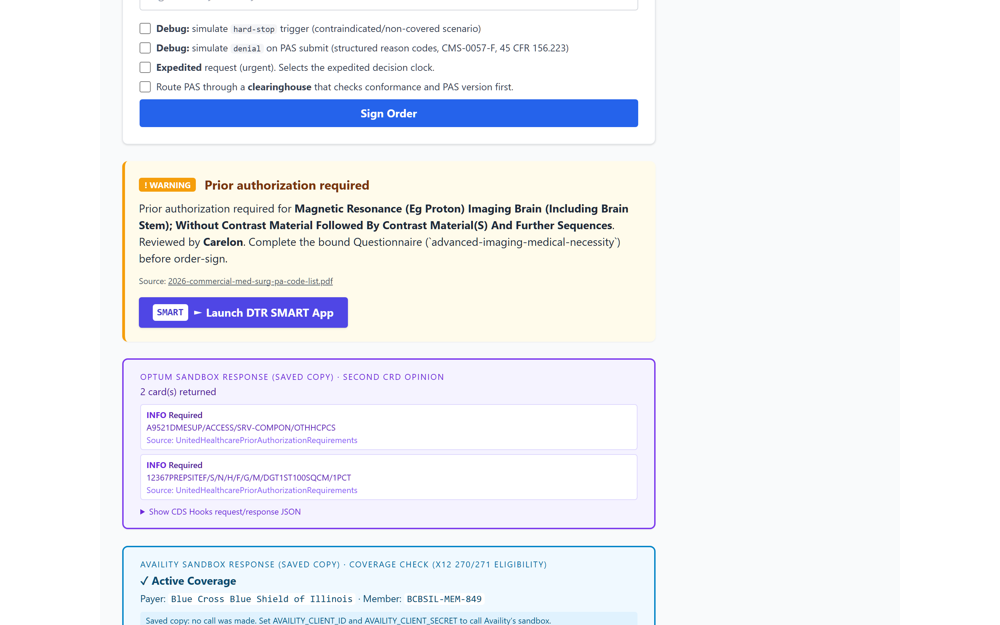
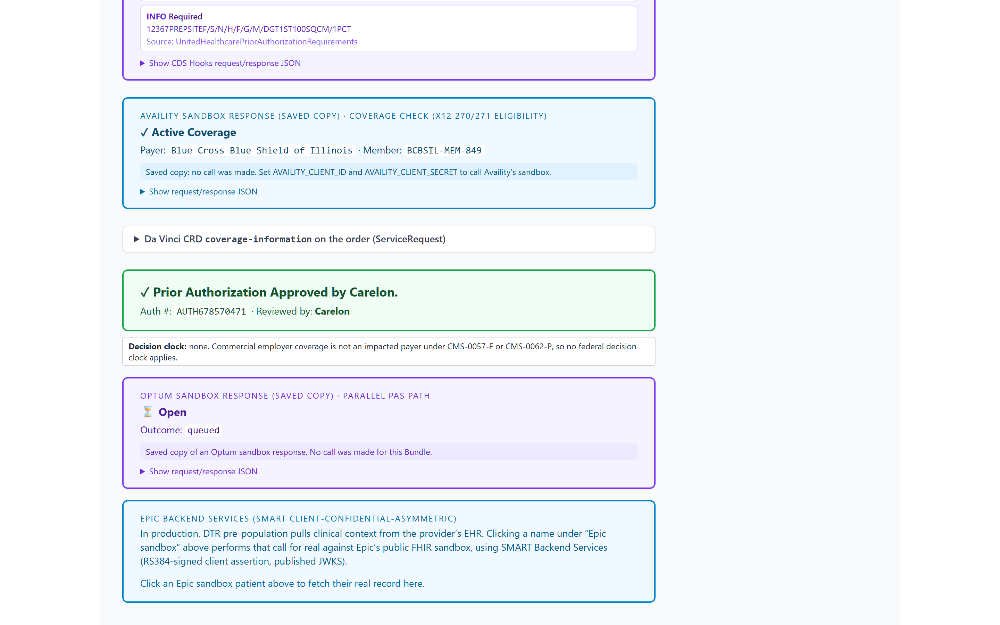
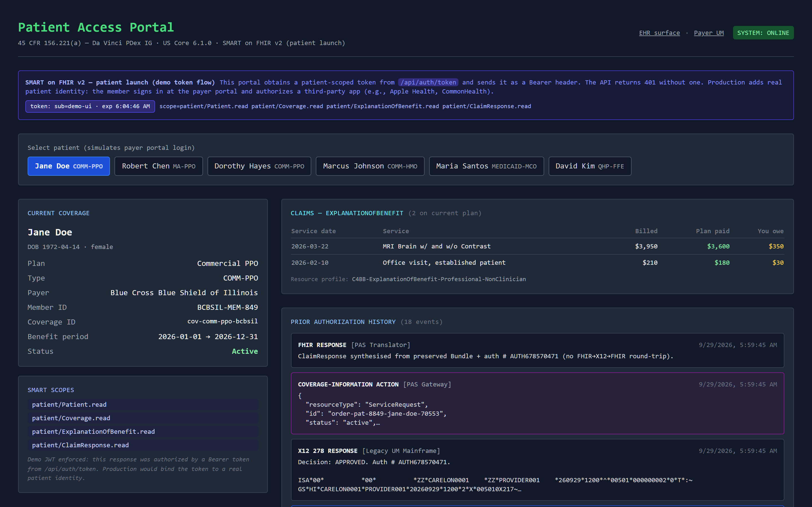
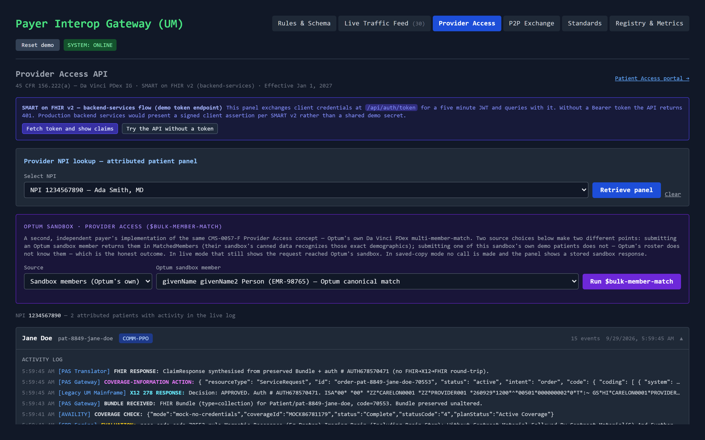
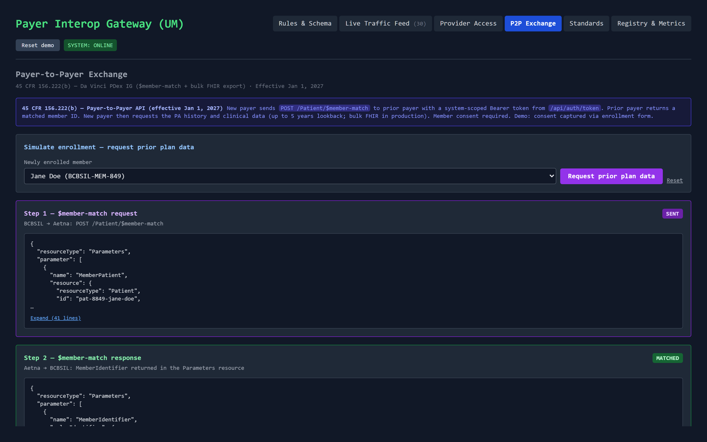
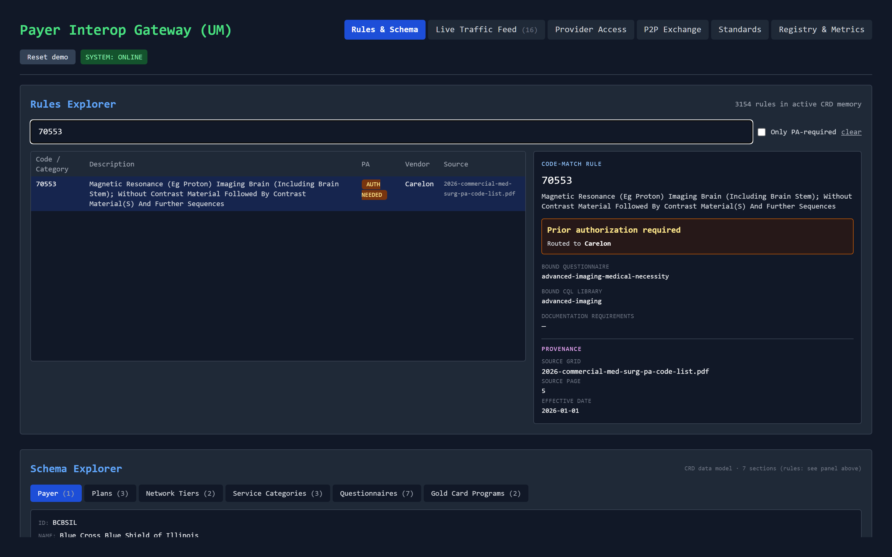

# Guided walkthroughs

## Prior Authorization API (`/ehr` + `/um`)

**Jane Doe (COMM-PPO)** is the baseline. `99214` returns an info card because the code is not on the PA list. `70553` (MRI Brain) returns a warning indicator, routes to Carelon, and offers the DTR launch. `J9035` (Avastin) with the oncology diagnosis preset returns a critical indicator also routed to Carelon, and the no-oncology-diagnosis variant keeps the same code but re-routes to BCBSIL, which is the conditional routing logic in `lib/routing.js`. Toggling hard-stop produces a non-overridable indicator that disables order-sign.

The DTR pane fetches the bound FHIR Questionnaire, renders `item[]` dynamically, and pre-populates answers marked with an SDC `initialExpression`. Submitting posts a PAS request Bundle (Patient + Coverage + Practitioner + Claim + QuestionnaireResponse, type `collection` with the PAS request-bundle profile). The response is a PAS response Bundle carrying a profiled ClaimResponse plus the order (a ServiceRequest) with the Da Vinci CRD coverage-information extension.

For the pended path, switch to **Robert Chen (MA-PPO)** and order `15820` (blepharoplasty). The 2026 grids list that code on the Medicare Advantage list only, which is why the scenario runs under the MA plan.

- The EHR shows an amber pending state, a decision clock (7 calendar days standard, 72 hours if **Expedited** is checked), and a Da Vinci CDex attachment request for a progress note
- **Submit requested attachment** sends `$submit-attachment` → the request re-enters clinical review → it finalizes on the first poll after the eight second review window (`lib/pendedReview.js`)
- Without the attachment the request stays pended
- The feed shows `BUNDLE RECEIVED` → `PA PENDED` → `CDEX ATTACHMENT REQUESTED` → `CDEX ATTACHMENT RECEIVED` → `PA APPROVED (pended → finalized)` → `REST-HOOK NOTIFICATION`

For the denial path, check **simulate denial** before submitting any PA-required order. The ClaimResponse returns `outcome: complete` with the PAS review action `A3` (not certified), X12 886 reason code `0F`, and appeal language, which the operational provisions of the rule require of real denials.

**Dorothy Hayes (COMM-PPO)** has `27447` (TKA) pre-filled and demonstrates the gold-card exemption: Dr. Patel's NPI is enrolled in the Orthopedic Gold Card program, so PA is auto-satisfied. **Marcus Johnson (COMM-HMO)** demonstrates category-level matching, with an ABA order routed to Lucet.

## Patient Access API (`/patient`)

The portal obtains a patient-scoped demo token, displays its decoded claims, and polls the Patient Access API with it. The response carries a US Core 6.1.0 Patient, a CARIN BB shaped Coverage, CARIN BB ExplanationOfBenefit resources with the three-part adjudication totals, and the member's PA event history. Selecting a different member re-fetches immediately.

## Provider Access API (`/um` Provider Access tab)

The panel exchanges client credentials for a system-scoped token and retrieves the attributed patient panel for an NPI. The banner includes a **Try the API without a token** button, which surfaces the live 401 and its OperationOutcome, and a control that shows the decoded token claims.

## Payer-to-Payer API (`/um` P2P Exchange tab)

Step 1 sends `POST /Patient/$member-match` with a Parameters body. Step 2 shows the pure Parameters response, and the client reads `MemberIdentifier.valueIdentifier.value` the way a production caller would. Step 3 fetches the prior plan history as a FHIR searchset Bundle: a cancelled prior Coverage, one ClaimResponse per prior authorization (including a denial carried as review action `A3` with an X12 886 reason code, and appeal rights in `processNote`), and CARIN BB EOBs. Jane Doe's prior payer is Aetna and Marcus Johnson's is Cigna, with different histories.

## CMS-0062-P additions (proposed rule)

The proposed rule extends prior authorization to drugs, proposes FHIR as the HIPAA standard, and adds reporting. The build plan and the reasoning behind each part are in [cms-0062-p-implementation-plan.md](cms-0062-p-implementation-plan.md).

**One drug, two benefits (`/ehr`).** Pick certolizumab (Cimzia), which the real BCBSIL specialty pharmacy grid lists as J0717 with the note "not for use when drug is self administered".

- Clinic-administered → medical benefit → CRD → DTR → PAS, with a questionnaire generated from the shared drug model
- Self-administered syringe → pharmacy benefit → RTPB → F&B → NCPDP ePA, routed to Prime Therapeutics. The NCPDP messages are illustrative and say so
- Both tracks ask the same questions and decide with the same function. Leave "tried and failed a conventional therapy" unchecked and both deny with X12 886 reason `44`
- Run one track, then the other, and the second one arrives with the answers carried over. The shared record at the bottom shows both tracks

**Decision clocks (`/ehr`, `/um` feed).** Every decision shows its legal clock and the citation behind it.

- **Maria Santos** (Medicaid managed care): one 24-hour drug clock plus the 72-hour emergency supply
- **David Kim** (individual market QHP on an FFE, illustrative because Illinois runs a state-based exchange from 2026): the proposed 72-hour standard and 24-hour expedited drug clock, plus a toggle for the FFE issuer exception from the NCPDP requirement, shown with an end date
- Commercial employer plans are not impacted payers, so the badge says no federal clock applies

**Drug PAs in the access APIs and at the pharmacy.** Drug decisions appear in `/patient`, in the `/um` Provider Access panel, and in Payer-to-Payer history as ExplanationOfBenefit resources with `use: preauthorization`. `/pharmacy` lets a dispensing pharmacy look up the same decision by member ID and NDC over a SMART-scoped read. The medical-benefit EOB claims the PDex Prior Authorization profile. The NDC-coded pharmacy one does not, because that profile only admits CPT, HCPCS, and HIPPS codes.

**Standards, reporting, and intermediaries (`/um`).**

- **Standards** tab: each implementation guide's version in the sandbox, in 45 CFR 170.215 today, and in the proposed rule, with a sunset marker. The CapabilityStatement pins the same versions
- **Registry & Metrics** tab: base FHIR `Endpoint` resources for the four APIs, API usage with third-party error rates (**Send a call with a bad token** moves the rate), and PA metrics as counts and percentages, medical and drug
- The FHIR ↔ X12 drawer shows X12 278 as the current HIPAA standard and FHIR PAS as the proposed one
- In `/ehr`, **Route PAS through a clearinghouse** checks conformance and PAS version before forwarding. The debug option to claim PAS 1.1.0 shows a rejection that never reaches the payer

## Rule ingestion pipeline (`/um` Rules & Schema tab)

The sandbox boots with the snapshot loaded, so the ingestion story starts from the **Reset to an empty index** link: upload one or more PA grid PDFs, watch the extraction land in a staging review with per-source metrics and a quality gate, then commit to the live CRD index. The Rules Explorer resolves any code or category against the committed index and shows routing, bound questionnaire, and provenance down to the source page.
